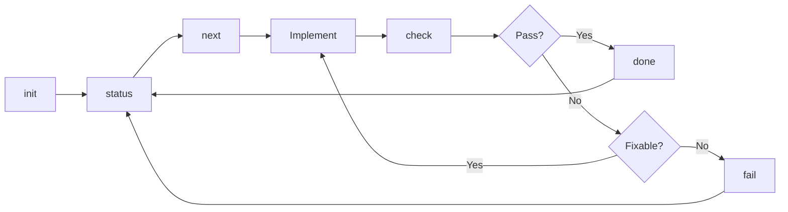

# Agent-Foreman CLI Commands

Comprehensive documentation for all agent-foreman CLI commands.

## Command Overview

| Command | Description | Primary Use |
|---------|-------------|-------------|
| [`init`](./init.md) | Initialize or upgrade the long-task harness | Project setup |
| [`next`](./next.md) | Show next task to work on | Task selection |
| [`status`](./status.md) | Show current harness status | Progress tracking |
| [`check`](./check.md) | AI-powered verification (no status change) | Task verification |
| [`done`](./done.md) | Verify and mark task complete | Task completion |
| [`fail`](./fail.md) | Mark task as failed | Failure handling |
| [`tdd`](./tdd.md) | View or change TDD mode | TDD configuration |
| [`impact`](./impact.md) | Analyze change impact | Dependency analysis |
| [`install`](./install.md) | Install Claude Code plugin | Plugin management |
| [`uninstall`](./uninstall.md) | Remove Claude Code plugin | Plugin management |
| [`agents`](./agents.md) | Show AI agents status | Agent management |

## Workflow Commands

### Core Task Workflow



### Typical Session

```bash
# 1. Initialize (first time only)
agent-foreman init "Build a REST API"

# 2. Check current status
agent-foreman status

# 3. Get next task
agent-foreman next

# 4. Implement the task...

# 5. Verify implementation
agent-foreman check task.id

# 6. Mark as complete
agent-foreman done task.id

# 7. Repeat from step 2
```

## Analysis Commands

### Project Analysis

```bash
# Generate architecture docs only
agent-foreman init --analyze

# Detect verification capabilities only
agent-foreman init --scan

# Check AI agent status
agent-foreman agents
```

## Plugin Commands

### Claude Code Integration

```bash
# Install plugin
agent-foreman install

# Remove plugin
agent-foreman uninstall
```

## Command Categories

### Initialization & Setup

| Command | When to Use |
|---------|-------------|
| `init` | First time setup, re-initialization |
| `init --scan` | After adding new dev tools (re-detect capabilities) |
| `install` | Enable Claude Code integration |

### Daily Development

| Command | When to Use |
|---------|-------------|
| `next` | Start working on a task |
| `check` | Verify task implementation |
| `done` | Complete a task |
| `fail` | Mark task as failed (when verification fails and you want to continue) |
| `status` | Track overall progress |
| `tdd` | View or change TDD mode |

### Analysis & Maintenance

| Command | When to Use |
|---------|-------------|
| `init --analyze` | Generate/update architecture docs |
| `impact` | Before/after significant changes |

## Common Options

Many commands share common options:

| Option | Commands | Description |
|--------|----------|-------------|
| `--verbose, -v` | init, check, done | Detailed output |
| `--json` | next, status | Machine-readable output |
| `--quiet, -q` | next, status | Minimal output |
| `--force, -f` | init (with --scan), install | Bypass cache/checks |

## Exit Codes

| Code | Meaning |
|------|---------|
| 0 | Success |
| 1 | Error (check message) |

## Data Files

Commands interact with these files:

| File | Purpose | Commands |
|------|---------|----------|
| `ai/tasks/index.json` | Task index | All task commands |
| `ai/tasks/{module}/*.md` | Task definitions | next, check, done |
| `ai/progress.log` | Activity log | next, check, done |
| `ai/capabilities.json` | Capability cache | init --scan, check, done |
| `docs/ARCHITECTURE.md` | Project docs | init --analyze, done |

## Getting Help

```bash
# General help
agent-foreman --help

# Command-specific help
agent-foreman <command> --help
```

## Related Documentation

- [Workflow Rules](../../src/rules/templates/01-workflow.md)
- [TDD Mode](../../src/rules/templates/05-tdd.md)
- [Feature Schema](../../src/rules/templates/04-feature-schema.md)
