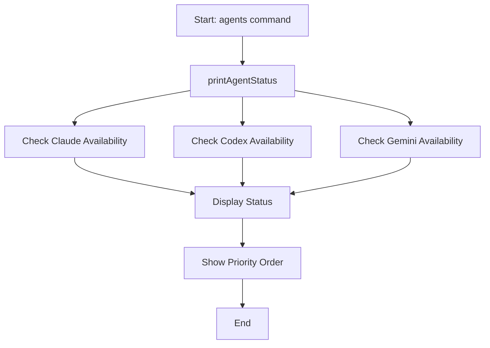
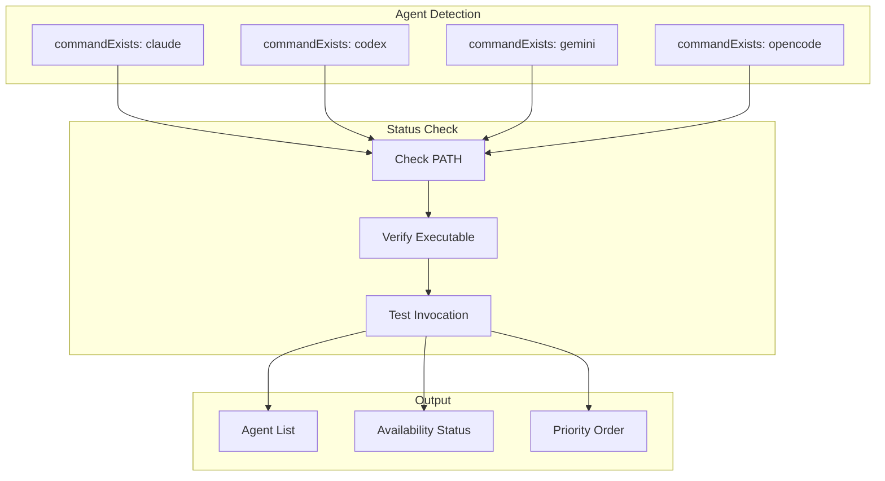
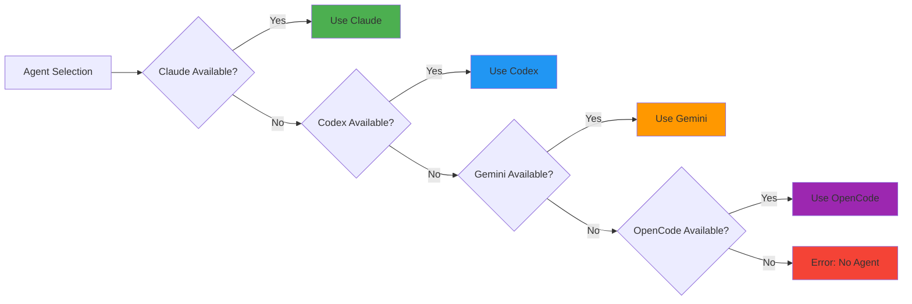

# agents Command

Show available AI agents status and priority.

## Command Syntax

```bash
agent-foreman agents
```

## Description

The `agents` command displays the status of available AI agents (Claude, Codex, Gemini, OpenCode) and their priority order for use in analysis, verification, and other AI-powered operations.

## Execution Flow



## Data Flow Diagram



## Key Functions

### `printAgentStatus()`

**Location**: `src/agents/orchestrator.ts:127`

Prints the status of all configured AI agents.

**Output**:
- Lists each agent with availability status
- Shows current priority order
- Indicates which agent will be used

### `commandExists(command)`

**Location**: `src/agents/detection.ts:21`

Checks if a command is available in the system PATH.

**Returns**: `boolean`

### `getAvailableAgent()`

**Location**: `src/agents/detection.ts:32`

Gets the first available agent based on priority.

**Returns**: `AgentConfig | null`

### `getAgentPriorityString()`

**Location**: `src/agents/orchestrator.ts:140`

Returns a string representation of agent priority.

**Returns**: `string` (e.g., "claude → codex → gemini → opencode")

## Agent Configuration

```typescript
const DEFAULT_AGENTS: AgentConfig[] = [
  {
    name: 'claude',
    command: 'claude',
    priority: 1,
  },
  {
    name: 'codex',
    command: 'codex',
    priority: 2,
  },
  {
    name: 'gemini',
    command: 'gemini',
    priority: 3,
  },
  {
    name: 'opencode',
    command: 'opencode',
    priority: 4,
  },
];
```

## Agent Priority Order



| Priority | Agent | Command | Description |
|----------|-------|---------|-------------|
| 1 | Claude | `claude` | Anthropic's Claude CLI |
| 2 | Codex | `codex` | OpenAI's Codex CLI |
| 3 | Gemini | `gemini` | Google's Gemini CLI |
| 4 | OpenCode | `opencode` | OpenCode CLI |

## Output Example

```
🤖 AI Agent Status

Available Agents:
  ✓ claude (priority: 1) - ACTIVE
  ✓ codex (priority: 2)
  ✗ gemini (priority: 3) - not found
  ✗ opencode (priority: 4) - not found

Priority Order: claude → codex → gemini → opencode

Current Agent: claude
```

### All Agents Available

```
🤖 AI Agent Status

Available Agents:
  ✓ claude (priority: 1) - ACTIVE
  ✓ codex (priority: 2)
  ✓ gemini (priority: 3)
  ✓ opencode (priority: 4)

Priority Order: claude → codex → gemini → opencode

Current Agent: claude
```

### Only Gemini Available

```
🤖 AI Agent Status

Available Agents:
  ✗ claude (priority: 1) - not found
  ✗ codex (priority: 2) - not found
  ✓ gemini (priority: 3) - ACTIVE
  ✗ opencode (priority: 4) - not found

Priority Order: claude → codex → gemini → opencode

Current Agent: gemini
```

### No Agents Available

```
🤖 AI Agent Status

Available Agents:
  ✗ claude (priority: 1) - not found
  ✗ codex (priority: 2) - not found
  ✗ gemini (priority: 3) - not found
  ✗ opencode (priority: 4) - not found

Priority Order: claude → codex → gemini → opencode

⚠ No AI agents available!
Install at least one: claude, codex, gemini, or opencode
```

## Agent Usage

Agents are used by these commands:

| Command | Agent Usage |
|---------|-------------|
| `init` | Project analysis |
| `init --analyze` | Architecture analysis |
| `check` | AI verification |
| `done` | Verification (when enabled) |

## Examples

### Check Agent Status

```bash
# View all agent status
agent-foreman agents
```

## Installing Agents

### Claude CLI (Claude Code)

```bash
# Native installer (Recommended - no Node.js required)
curl -fsSL https://claude.ai/install.sh | bash

# Via npm (requires Node.js 18+)
npm install -g @anthropic-ai/claude-code

# Verify installation
claude --version
claude doctor
```

See: [Claude Code Setup](https://code.claude.com/docs/en/setup)

### Codex CLI

```bash
# Via npm
npm install -g @openai/codex

# Via Homebrew (macOS)
brew install --cask codex

# Verify installation
codex --version
```

See: [OpenAI Codex CLI](https://developers.openai.com/codex/cli)

### Gemini CLI

```bash
# Via npm (Recommended)
npm install -g @google/gemini-cli

# Run without installing (for testing)
npx @google/gemini-cli

# Verify installation
gemini --version
```

See: [Gemini CLI GitHub](https://github.com/google-gemini/gemini-cli)

### OpenCode CLI

```bash
# Quick install script (Recommended)
curl -fsSL https://opencode.ai/install | bash

# Via npm
npm install -g opencode-ai@latest

# Via Homebrew (macOS/Linux)
brew install opencode

# Via Scoop (Windows)
scoop bucket add extras && scoop install extras/opencode

# Verify installation
opencode --version
```

See: [OpenCode GitHub](https://github.com/sst/opencode)

## Agent Selection API

```typescript
// Get first available agent
const agent = getAvailableAgent();
if (agent) {
  console.log(`Using: ${agent.name}`);
}

// Check specific agent
if (commandExists('claude')) {
  // Claude is available
}

// Get all available agents
const agents = filterAvailableAgents(DEFAULT_AGENTS);
```

## Error Handling

| Error | Cause | Resolution |
|-------|-------|------------|
| "No AI agents available" | No CLIs installed | Install claude, codex, gemini, or opencode |
| Agent not found | CLI not in PATH | Check installation and PATH |

## Related Commands

- [`init`](./init.md) - Uses agents for analysis
- [`check`](./check.md) - Uses agents for verification
