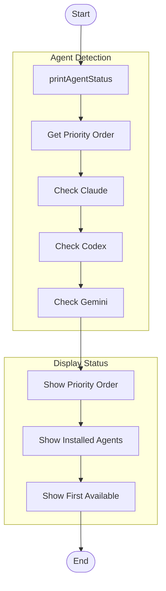
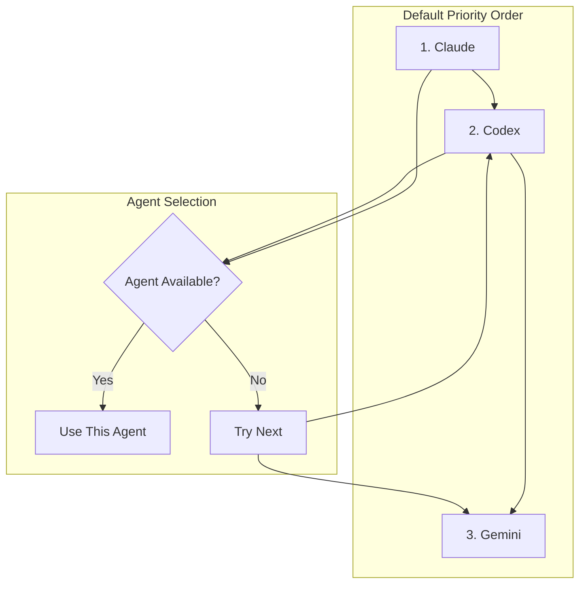
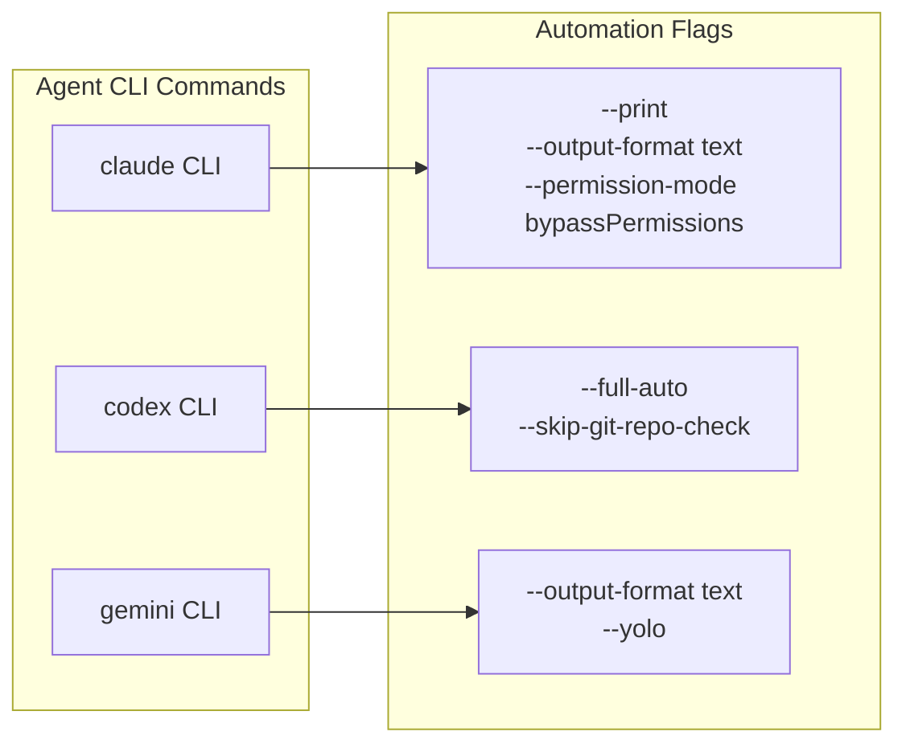
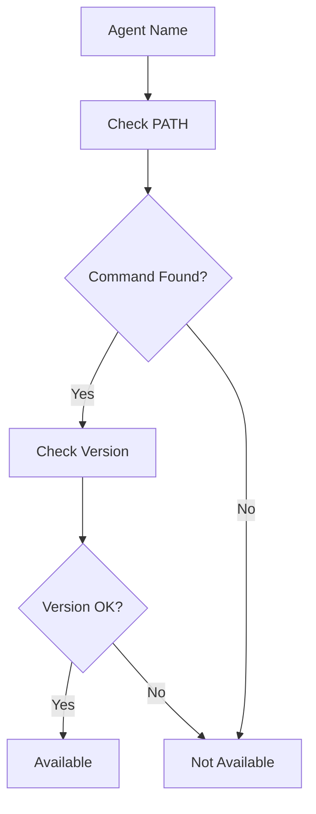
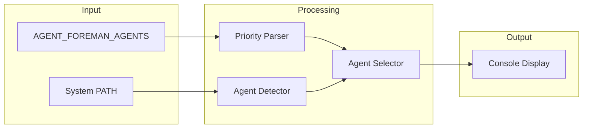

# agents Command

Show available AI agents and their status.

> 显示可用的 AI 代理及其状态。

## Synopsis

```bash
agent-foreman agents
```

## Description

The `agents` command displays which AI agents are available on the system and their priority order. It helps users understand which agent will be used for AI-powered operations like analysis, verification, and capability detection.

> `agents` 命令显示系统上可用的 AI 代理及其优先级顺序。它帮助用户了解哪个代理将用于 AI 驱动的操作，如分析、验证和能力检测。

## Options

This command has no options.

## Execution Flow



## Agent Priority System



### Priority Order

The default priority order is:
1. **Claude** (highest priority)
2. **Codex**
3. **Gemini** (lowest priority)

The first available agent in priority order will be used for all AI operations.

### Environment Variable Override

The priority order can be customized using the `AGENT_FOREMAN_AGENTS` environment variable:

```bash
# Use Gemini first, then Claude
export AGENT_FOREMAN_AGENTS="gemini,claude"

# Use only Codex
export AGENT_FOREMAN_AGENTS="codex"
```

## Agent CLI Invocations



### Claude
```bash
claude --print --output-format text --permission-mode bypassPermissions -
```
- `--print`: Output response only
- `--output-format text`: Plain text output
- `--permission-mode bypassPermissions`: Allow all operations
- `-`: Read prompt from stdin

### Codex
```bash
codex exec --skip-git-repo-check --full-auto -
```
- `--skip-git-repo-check`: Skip git repository validation
- `--full-auto`: Fully autonomous mode
- `-`: Read prompt from stdin

### Gemini
```bash
gemini --output-format text --yolo
```
- `--output-format text`: Plain text output
- `--yolo`: Autonomous mode (skip confirmations)

## Agent Availability Detection



Agent availability is detected by:
1. Checking if the CLI command exists in PATH
2. Optionally checking version compatibility

## Data Flow Diagram



## Dependencies

### Internal Modules

- `src/agents.ts` - Agent management
  - `printAgentStatus()` - Display agent status
  - `getAgentPriorityString()` - Get priority order string
  - `getAvailableAgents()` - Detect available agents
  - `spawnAgent()` - Spawn agent subprocess

### External Dependencies

- AI CLI tools (optional, at least one required):
  - `claude` - Anthropic Claude CLI
  - `codex` - OpenAI Codex CLI
  - `gemini` - Google Gemini CLI

## Files Read

None - this command only checks system PATH.

## Files Written

None - this is a read-only status command.

## Exit Codes

| Code | Meaning |
|------|---------|
| 0 | Success (always) |

## Examples

### Check Agent Status

```bash
# Show available agents
agent-foreman agents
```

### Custom Priority

```bash
# Set custom priority order
export AGENT_FOREMAN_AGENTS="gemini,claude,codex"
agent-foreman agents
```

## Console Output Example

### All Agents Available

```
🤖 AI Agent Status

   Priority Order: Claude > Codex > Gemini

   Installed Agents:
   ✓ Claude (v1.2.3)
   ✓ Codex (v0.8.1)
   ✓ Gemini (v2.0.0)

   First Available: Claude
```

### Partial Availability

```
🤖 AI Agent Status

   Priority Order: Claude > Codex > Gemini

   Installed Agents:
   ✗ Claude - not found
   ✓ Codex (v0.8.1)
   ✓ Gemini (v2.0.0)

   First Available: Codex
```

### No Agents Available

```
🤖 AI Agent Status

   Priority Order: Claude > Codex > Gemini

   Installed Agents:
   ✗ Claude - not found
   ✗ Codex - not found
   ✗ Gemini - not found

   ⚠ No AI agents available!
   Install at least one of: claude, codex, gemini
```

### Custom Priority Order

```
🤖 AI Agent Status

   Priority Order: Gemini > Claude (custom via AGENT_FOREMAN_AGENTS)

   Installed Agents:
   ✓ Claude (v1.2.3)
   ✓ Gemini (v2.0.0)

   First Available: Gemini
```

## Installing AI Agents

### Claude (Anthropic)

```bash
# Install Claude CLI
npm install -g @anthropic-ai/claude-cli

# Configure API key
export ANTHROPIC_API_KEY="your-api-key"
```

### Codex (OpenAI)

```bash
# Install Codex CLI
npm install -g @openai/codex-cli

# Configure API key
export OPENAI_API_KEY="your-api-key"
```

### Gemini (Google)

```bash
# Install Gemini CLI
npm install -g @google/gemini-cli

# Configure API key
export GOOGLE_API_KEY="your-api-key"
```

## Use Cases

### Debugging Agent Issues

```bash
# Check which agent is being used
agent-foreman agents

# If wrong agent, set custom priority
export AGENT_FOREMAN_AGENTS="claude"
```

### CI/CD Configuration

```bash
# Ensure specific agent in CI
export AGENT_FOREMAN_AGENTS="codex"
agent-foreman init
```

### Multi-Model Workflows

```bash
# Use different agents for different operations
AGENT_FOREMAN_AGENTS="claude" agent-foreman analyze
AGENT_FOREMAN_AGENTS="gemini" agent-foreman check feature.id
```

## Related Commands

- `agent-foreman analyze` - Uses AI agent for analysis
- `agent-foreman init` - Uses AI agent for project detection
- `agent-foreman check` - Uses AI agent for verification
- `agent-foreman scan` - Uses AI agent for capability detection
