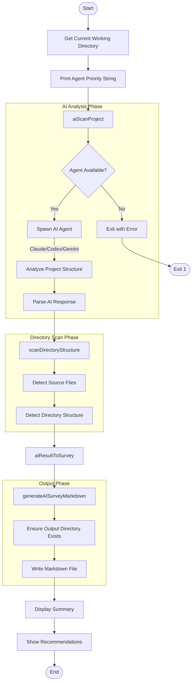
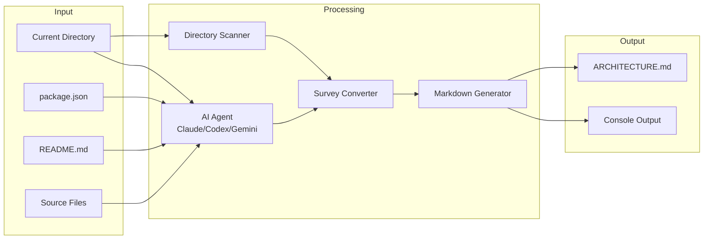

# analyze Command

Generate AI-powered project analysis report.

> 生成 AI 驱动的项目分析报告。

## Synopsis

```bash
agent-foreman analyze [output]
```

## Description

The `analyze` command scans the entire project and generates a comprehensive architecture analysis report using AI. It detects tech stack, modules, features, and provides recommendations for improvement.

> `analyze` 命令扫描整个项目并使用 AI 生成全面的架构分析报告。它检测技术栈、模块、功能，并提供改进建议。

## Options

| Option | Alias | Default | Description |
|--------|-------|---------|-------------|
| `--output` | `-o` | `docs/ARCHITECTURE.md` | Output markdown file path |
| `--verbose` | `-v` | `false` | Show detailed output |

## Execution Flow



## Detailed Step-by-Step Flow

### 1. Initialization
- Get current working directory (`cwd`)
- Display agent priority string (Claude > Codex > Gemini by default)
- If verbose mode, print detailed agent status

### 2. AI Analysis Phase
- Call `aiScanProject(cwd, {verbose})` from `src/ai-scanner.ts`
- This spawns an AI agent (Claude, Codex, or Gemini) with a structured prompt
- AI analyzes:
  - Project type and framework
  - Directory structure
  - Tech stack
  - Modules and their responsibilities
  - Features (implemented and potential)
  - Completion percentage
  - Recommendations

### 3. Directory Structure Scan
- Call `scanDirectoryStructure(cwd)` from `src/project-scanner.ts`
- Scan project directories to build file tree
- Detect source files, test files, config files

### 4. Survey Generation
- Convert AI result to `ProjectSurvey` type via `aiResultToSurvey()`
- Merge AI insights with directory structure data

### 5. Markdown Generation
- Generate comprehensive markdown report via `generateAISurveyMarkdown()`
- Include:
  - Tech stack overview
  - Module breakdown
  - Feature list with status
  - Completion metrics
  - AI recommendations

### 6. Output
- Ensure output directory exists
- Write markdown file to specified path
- Display summary statistics

## Data Flow Diagram



## Dependencies

### Internal Modules
- `src/ai-scanner.ts` - AI scanning orchestration
  - `aiScanProject()` - Main AI analysis function
  - `aiResultToSurvey()` - Convert AI result to survey
  - `generateAISurveyMarkdown()` - Generate markdown report
- `src/project-scanner.ts` - Directory structure detection
  - `scanDirectoryStructure()` - Scan project files
- `src/agents.ts` - Agent status and priority
  - `printAgentStatus()` - Display agent availability
  - `getAgentPriorityString()` - Get priority order string

### External Dependencies
- `chalk` - Console output styling
- AI CLI tools: `claude`, `codex`, or `gemini` (at least one required)

## Files Read

| File | Purpose |
|------|---------|
| `package.json` | Detect project type, dependencies |
| `README.md` | Extract project description |
| Source files (`src/**/*`) | Analyze code structure |
| Config files | Detect frameworks, tools |

## Files Written

| File | Default Path | Purpose |
|------|--------------|---------|
| Architecture Report | `docs/ARCHITECTURE.md` | Generated analysis |

## Exit Codes

| Code | Meaning |
|------|---------|
| 0 | Success |
| 1 | AI analysis failed (no agent available) |

## Examples

### Basic Usage
```bash
# Generate default report at docs/ARCHITECTURE.md
agent-foreman analyze
```

### Custom Output Path
```bash
# Write to custom location
agent-foreman analyze -o reports/project-analysis.md
```

### Verbose Mode
```bash
# Show detailed agent status and progress
agent-foreman analyze -v
```

## Console Output Example

```
🤖 AI-powered project analysis (priority: Claude > Codex > Gemini)
✓ AI analysis successful (agent: claude)
✓ Analysis written to docs/ARCHITECTURE.md
  Tech stack: TypeScript/Node.js
  Modules: 12
  Features: 45
  Completion: 78%

📝 Summary:
  A feature-driven development harness for AI agents...

💡 Recommendations:
  1. Add integration tests for verifier module
  2. Consider splitting large modules
  3. Add JSDoc comments for public APIs
```

## Related Commands

- `agent-foreman init` - Initialize harness (uses similar AI analysis)
- `agent-foreman scan` - Scan project capabilities
- `agent-foreman status` - View feature status
