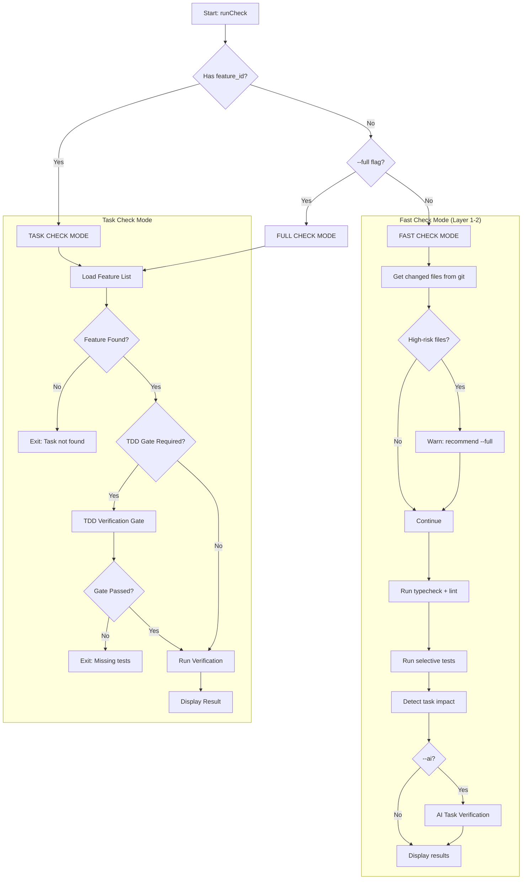
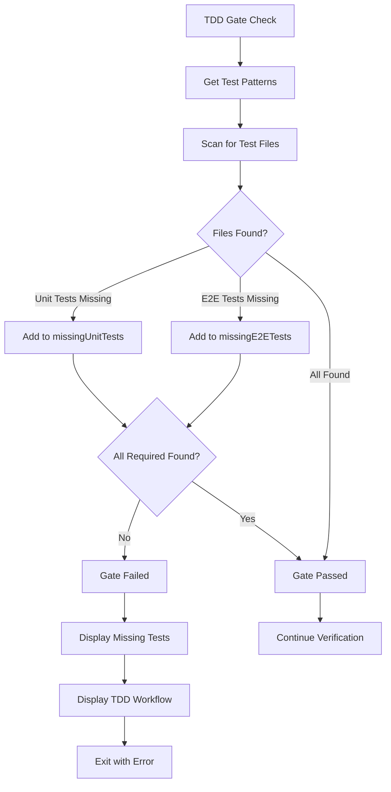

# check Command

AI-powered verification of code changes or task completion.

## Command Syntax

```bash
agent-foreman check [feature_id] [options]
```

## Description

The `check` command provides layered verification with three modes:

| Mode | Command | Description | Duration |
|------|---------|-------------|----------|
| **Fast** (default) | `check` | Git diff → selective tests + task impact | 10-30s |
| **AI** | `check --ai` | Fast + AI verification for affected tasks | 2-5 min |
| **Full** | `check --full` | All tests + build + E2E + AI analysis | 5-10 min |
| **Task** | `check <task_id>` | Task-scoped full verification | varies |

## Arguments

| Argument | Type | Required | Description |
|----------|------|----------|-------------|
| `feature_id` | string | No | Task ID for full verification (omit for fast mode) |

## Options

| Option | Alias | Type | Default | Description |
|--------|-------|------|---------|-------------|
| `--full` | - | boolean | `false` | Run full verification (all tests + build + E2E) |
| `--ai` | - | boolean | `false` | Enable AI verification (autonomous exploration for tasks, affected tasks for fast mode) |
| `--verbose` | `-v` | boolean | `false` | Show detailed output |
| `--skip-checks` | `-s` | boolean | `false` | Skip automated checks, AI only |
| `--quick` | - | boolean | `true` | Run only related tests (for task mode) |
| `--test-pattern` | - | string | - | Explicit test pattern to use |
| `--skip-e2e` | - | boolean | `false` | Skip E2E tests entirely |

## Execution Flow



## Fast Check Mode (Default)

When running `agent-foreman check` without arguments:

### Layer 1: Fast Deterministic Checks
- TypeScript type checking (`tsc --noEmit`)
- Linting (if configured)
- Selective unit tests based on changed files

### Layer 2: Task Impact Detection
- Maps changed files to affected tasks using:
  1. Explicit `affectedBy` glob patterns (high confidence)
  2. Test patterns from `testRequirements` (medium confidence)
  3. Module-based matching (low confidence)

### Layer 3: AI Task Verification (opt-in)
- Enabled with `--ai` flag
- AI analyzes affected tasks against acceptance criteria

### Skipped by Default
- Build step
- E2E tests
- Full AI analysis

### High-Risk File Detection

The following files trigger a warning to use `--full`:
- `package.json`, `package-lock.json`, `pnpm-lock.yaml`, `yarn.lock`
- `tsconfig*.json`
- `.eslintrc*`, `eslint.config.*`
- `vite.config.*`, `vitest.config.*`, `playwright.config.*`
- `.env*`
- `Cargo.toml`, `go.mod`, `requirements.txt`

## Task Check Mode

When running `agent-foreman check <task_id>`:

### TDD Gate Verification

When TDD mode is `strict` or the feature has `testRequirements.required: true`:



### Verification Modes

#### Standard Mode (Default)
Uses diff-based analysis:
1. Gets git diff for recent changes
2. Runs automated checks (tests, typecheck, lint)
3. Generates verdict based on test results

#### AI Autonomous Mode (with `--ai`)
AI-powered exploration:
1. AI agent explores codebase
2. Identifies implementation files
3. Runs targeted tests
4. Deep analysis of acceptance criteria
5. Generates comprehensive verdict

## Key Functions

### `runCheck(featureId?, verbose, skipChecks, ai, testMode, testPattern, skipE2E, e2eMode, full)`

**Location**: `src/commands/check.ts:42`

Main entry point for the check command.

**Parameters**:
- `featureId?: string` - Task ID to verify (optional, triggers fast mode if omitted)
- `verbose: boolean` - Show detailed output
- `skipChecks: boolean` - Skip automated checks
- `ai: boolean` - Enable AI verification (autonomous exploration for tasks, affected tasks for fast mode)
- `testMode: 'full' | 'quick' | 'skip'` - Test execution mode
- `testPattern?: string` - Custom test pattern
- `skipE2E: boolean` - Skip E2E tests
- `e2eMode?: 'full' | 'smoke' | 'tags' | 'skip'` - E2E execution mode
- `full: boolean` - Run full verification

### `runLayeredCheck(cwd, options)`

**Location**: `src/verifier/layered-check.ts:115`

Executes fast layered check mode.

**Parameters**:
- `cwd: string` - Working directory
- `options: LayeredCheckOptions` - Check options

**Returns**: `LayeredCheckResult`

### `isHighRiskChange(files)`

**Location**: `src/verifier/layered-check.ts:105`

Checks if changed files are high-risk (config/deps).

**Returns**: `boolean`

### `getTaskImpact(cwd, changedFiles)`

**Location**: `src/verifier/task-impact.ts:32`

Maps changed files to affected tasks.

**Returns**: `TaskImpact[]`

### `verifyTDDGate(cwd, feature, metadata)`

**Location**: `src/test-gate.ts`

Verifies that required test files exist.

**Returns**:
```typescript
{
  passed: boolean;
  missingUnitTests: string[];
  missingE2ETests: string[];
  foundTestFiles: string[];
}
```

### `verifyFeature(cwd, feature, options)`

**Location**: `src/verifier/core.ts`

Standard verification with diff-based analysis.

**Returns**: `VerificationResult`

### `verifyFeatureAutonomous(cwd, feature, options)`

**Location**: `src/verifier/autonomous.ts`

Autonomous AI-powered verification.

**Returns**: `VerificationResult`

## Result Structures

### LayeredCheckResult

```typescript
interface LayeredCheckResult {
  // Layer 1: Fast checks
  changedFiles: string[];
  checks: {
    typecheck?: AutomatedCheckResult;
    lint?: AutomatedCheckResult;
    tests?: AutomatedCheckResult;
  };

  // Layer 2: Task impact
  affectedTasks: TaskImpact[];

  // Layer 3: AI verification (optional)
  taskVerification?: Array<{
    taskId: string;
    verdict: 'pass' | 'fail' | 'needs_review';
    reasoning: string;
  }>;

  // Summary
  duration: number;
  passed: boolean;
  skipped: string[];
  highRiskEscalation: boolean;
}
```

### TaskImpact

```typescript
interface TaskImpact {
  taskId: string;
  reason: string;
  confidence: 'high' | 'medium' | 'low';
  matchedFiles: string[];
}
```

### VerificationResult

```typescript
interface VerificationResult {
  verdict: 'pass' | 'fail' | 'needs_review';
  confidence: number; // 0-1
  criteriaResults: Array<{
    criterion: string;
    passed: boolean;
    evidence: string;
  }>;
  automatedChecks: {
    tests: { passed: boolean; output: string };
    typecheck: { passed: boolean; output: string };
    lint: { passed: boolean; output: string };
    e2e?: { passed: boolean; output: string };
  };
  aiAnalysis: {
    summary: string;
    suggestions: string[];
  };
}
```

## Output Examples

### Fast Check Mode

```
╭─ ⚡ FAST CHECK ──────────────────────────────────────╮
│ Changed: 3 files                                     │
│ Skipped: AI analysis, build, e2e                     │
│                                                      │
│ ✓ typecheck    passed (2.1s)                         │
│ ✓ lint         passed (1.3s)                         │
│ ✓ tests        passed (8.5s) [12 files]              │
│                                                      │
│ ⚡ FAST CHECK PASSED (11.9s)                         │
╰──────────────────────────────────────────────────────╯

ℹ TASK IMPACT:
  These changes may affect:
    • auth.login
      file in module: auth
    • api.users
      matches test pattern: tests/api/**/*.test.ts

  To verify acceptance criteria:
  $ agent-foreman check --ai
```

### Task Check Mode

```
═══════════════════════════════════════════════════════════════
                    TDD VERIFICATION GATE
═══════════════════════════════════════════════════════════════

   Mode: STRICT TDD (tests required by project configuration)
   ✓ Test files exist
     Found: tests/auth/login.test.ts, tests/auth/logout.test.ts

═══════════════════════════════════════════════════════════════
                      TASK VERIFICATION
═══════════════════════════════════════════════════════════════

📋 Task: auth.login
   Module: auth | Priority: 1
   Mode: AI autonomous exploration  # only shown with --ai flag
   Test mode: Quick (selective tests)

📝 Acceptance Criteria:
   1. User enters valid credentials and is logged in
   2. Invalid credentials show error message
   3. Session persists across page reloads

🔍 Running Verification...

✓ Tests passed (3/3)
✓ Type check passed
✓ Lint passed
✓ AI Analysis: All acceptance criteria satisfied

Verdict: PASS (confidence: 0.95)

   Results saved to ai/verification/results.json
   Feature list updated with verification summary

   ✓ Task verified successfully!
   Run 'agent-foreman done auth.login' to mark as passing
```

## Examples

### Fast Check (Default)

```bash
# Quick verification of current changes
agent-foreman check
```

### Fast Check with AI Task Verification

```bash
# Fast checks + AI verification for affected tasks
agent-foreman check --ai
```

### Full Verification

```bash
# Run all tests + build + E2E
agent-foreman check --full
```

### Task-Specific Verification

```bash
# Verify a specific task (without AI)
agent-foreman check auth.login

# Verify with AI autonomous exploration
agent-foreman check auth.login --ai
```

### Verbose Output

```bash
# See detailed output
agent-foreman check -v
agent-foreman check auth.login -v
```

### Skip E2E Tests

```bash
# Skip E2E tests for faster iteration
agent-foreman check auth.login --skip-e2e
```

### Custom Test Pattern

```bash
# Use specific test pattern
agent-foreman check auth.login --test-pattern "tests/auth/**/*.test.ts"
```

### AI Only

```bash
# Skip automated checks, rely on AI
agent-foreman check auth.login --skip-checks
```

## Error Handling

| Error | Cause | Resolution |
|-------|-------|------------|
| "No task list found" | Harness not initialized | Run `agent-foreman init` first |
| "Task not found" | Invalid feature ID | Check `agent-foreman status` for valid IDs |
| "TDD Gate Failed" | Required test files missing | Create test files matching patterns |
| "No changed files" | No git changes detected | Make changes first or use `--full` |

## Verdicts

| Verdict | Meaning | Next Step |
|---------|---------|-----------|
| `pass` | All criteria satisfied | Run `agent-foreman done <id>` |
| `fail` | Criteria not met | Fix issues and re-run |
| `needs_review` | Some criteria uncertain | Manual review needed |

## Related Commands

- [`next`](./next.md) - Get task details
- [`done`](./done.md) - Mark task complete after check
- [`impact`](./impact.md) - Analyze change impact
