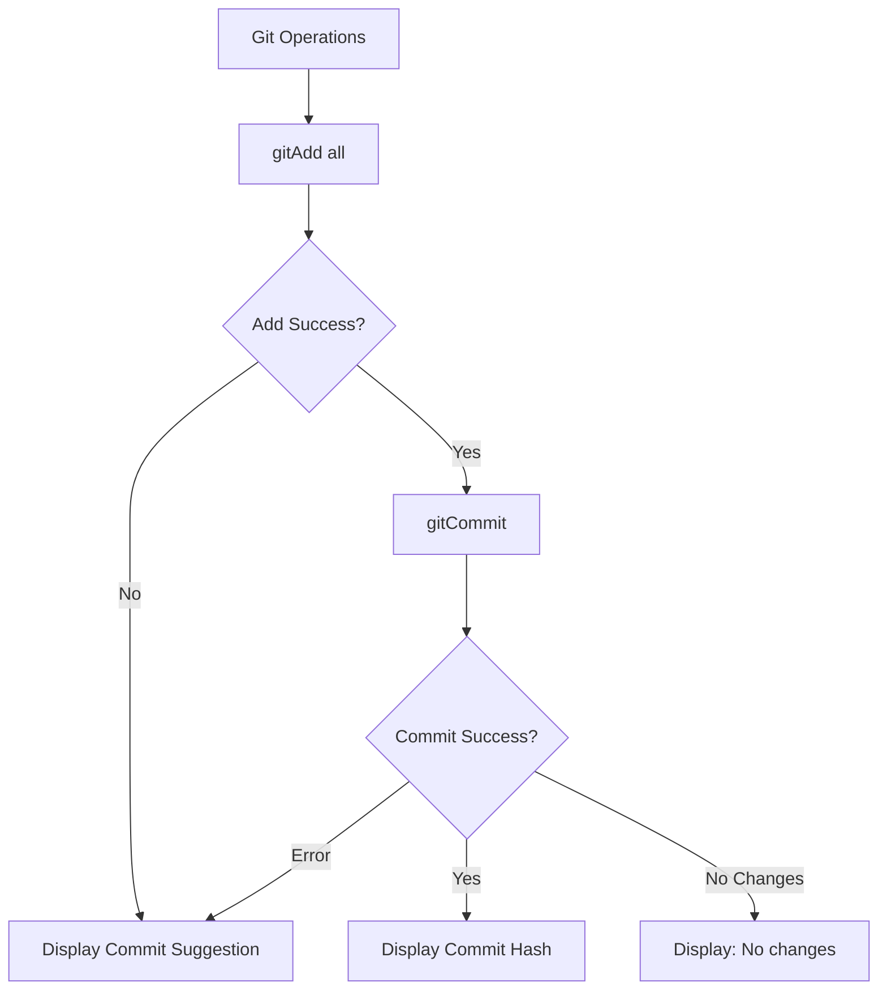

# done Command

Verify and mark a task/feature as complete.

## Command Syntax

```bash
agent-foreman done <feature_id> [options]
```

## Description

The `done` command marks a task as complete after optional verification. By default, it skips verification (assuming you ran `check` first) and updates the task status to `passing`. When AI verification returns `needs_review`, the status is set to `needs_review` instead of `passing` to preserve the AI's assessment. It also handles git commits, shows the next task, and supports loop mode for continuous task processing.

## Arguments

| Argument | Type | Required | Description |
|----------|------|----------|-------------|
| `feature_id` | string | Yes | Task ID to mark complete |

## Options

| Option | Alias | Type | Default | Description |
|--------|-------|------|---------|-------------|
| `--notes` | `-n` | string | - | Additional notes to add |
| `--no-commit` | - | boolean | `false` | Skip automatic git commit |
| `--skip-check` | - | boolean | `true` | Skip verification (use `--no-skip-check` to run) |
| `--verbose` | `-v` | boolean | `false` | Show detailed verification output |
| `--ai` | - | boolean | `false` | Enable AI autonomous exploration for verification |
| `--quick` | - | boolean | `true` | Run only related tests (selective) |
| `--full` | - | boolean | `false` | Force full test suite |
| `--test-pattern` | - | string | - | Explicit test pattern to use |
| `--skip-e2e` | - | boolean | `false` | Skip E2E tests entirely |
| `--loop` | - | boolean | `true` | Loop mode (use `--no-loop` to disable) |

## Execution Flow


## Data Flow Diagram


## TDD Gate Verification

Same as `check` command - verifies test files exist when:
- TDD mode is `strict`
- Feature has `testRequirements.*.required: true`

## Verification Process

When `--no-skip-check` is used:


## Loop Mode

When loop mode is active (default), after completing a task:

### If More Tasks Remain

```
══════════════════════════════════════════════════════════════
                   FEATURE LOOP MODE ACTIVE
══════════════════════════════════════════════════════════════

   Completed: auth.login (5/17 features)
   Next up: auth.logout
   Progress: 29% complete

   ⛔ NO QUESTIONS ALLOWED
   - NEVER ask: "Should I...", "Do you want...", "Which approach..."
   - ALWAYS make autonomous decisions and proceed
   - On ANY error: mark as failed, continue to next

   LOOP INSTRUCTION:
   1. agent-foreman next
   2. Implement task
   3. agent-foreman check <task_id>
   4. agent-foreman done <task_id>
   5. REPEAT until all tasks processed

   ➤ Do NOT stop. Do NOT ask questions. Continue NOW.
══════════════════════════════════════════════════════════════
```

### If All Tasks Complete

```
══════════════════════════════════════════════════════════════
                   FEATURE LOOP COMPLETE
══════════════════════════════════════════════════════════════

   All features have been processed.

   Summary:
   ✓ Passing: 15
   ✗ Failed: 2
   ⚠ Blocked: 0

   Run 'agent-foreman status' for details.
══════════════════════════════════════════════════════════════
```

## Git Commit Behavior

When `--no-commit` is NOT set and in a git repository:



**Commit Message Format**:
```
feat(module): Feature description

Feature: feature.id

🤖 Generated with agent-foreman
```

## Key Functions

### `runDone(featureId, notes, autoCommit, skipCheck, verbose, ai, testMode, testPattern, skipE2E, e2eMode, loopMode)`

**Location**: `src/commands/done.ts:57`

Main entry point for the done command.

### `runVerification(...)`

**Location**: `src/commands/done.ts:279`

Internal function that runs verification when `--no-skip-check` is used.

### `handleCommit(cwd, feature, autoCommit)`

**Location**: `src/commands/done.ts:368`

Handles git add and commit operations.

### `regenerateSurvey(cwd, featureList)`

**Location**: `src/commands/done-helpers.ts:16`

Regenerates `docs/ARCHITECTURE.md` when all features complete.

## Status Update Process


## Examples

### Basic Completion

```bash
# Mark task as done (skips verification by default)
agent-foreman done auth.login
```

### With Verification

```bash
# Run verification before marking complete
agent-foreman done auth.login --no-skip-check
```

### With Notes

```bash
# Add implementation notes
agent-foreman done auth.login --notes "Used JWT for session management"
```

### Skip Git Commit

```bash
# Don't auto-commit
agent-foreman done auth.login --no-commit
```

### Full Verification

```bash
# Run full test suite during verification
agent-foreman done auth.login --no-skip-check --full
```

### With AI Verification

```bash
# Run verification with AI autonomous exploration
agent-foreman done auth.login --no-skip-check --ai
```

### Disable Loop Mode

```bash
# Don't show loop continuation instructions
agent-foreman done auth.login --no-loop
```

## Workflow Recommendations

### Standard Workflow

```bash
# 1. Get task
agent-foreman next auth.login

# 2. Implement task
# ... coding ...

# 3. Verify implementation
agent-foreman check auth.login

# 4. Mark complete (skip re-verification)
agent-foreman done auth.login
```

### Quick Iteration

```bash
# Verify and complete in one step
agent-foreman done auth.login --no-skip-check
```

### AI Agent Loop

```bash
# For AI agents in continuous mode
agent-foreman next
# implement
agent-foreman check <task_id>
agent-foreman done <task_id>
# repeat...
```

## Error Handling

| Error | Cause | Resolution |
|-------|-------|------------|
| "No task list found" | Harness not initialized | Run `agent-foreman init` |
| "Task not found" | Invalid feature ID | Check with `agent-foreman status` |
| "TDD Gate Failed" | Missing required test files | Create test files first |
| "Verification failed" | Tests or criteria not met | Fix issues and re-run |

## Survey Regeneration

When all tasks are complete:
1. AI scans project structure
2. Updates `docs/ARCHITECTURE.md`
3. Shows 100% completion status

## Related Commands

- [`next`](./next.md) - Get next task
- [`check`](./check.md) - Verify without marking done
- [`status`](./status.md) - View overall progress
- [`impact`](./impact.md) - Analyze change impact
