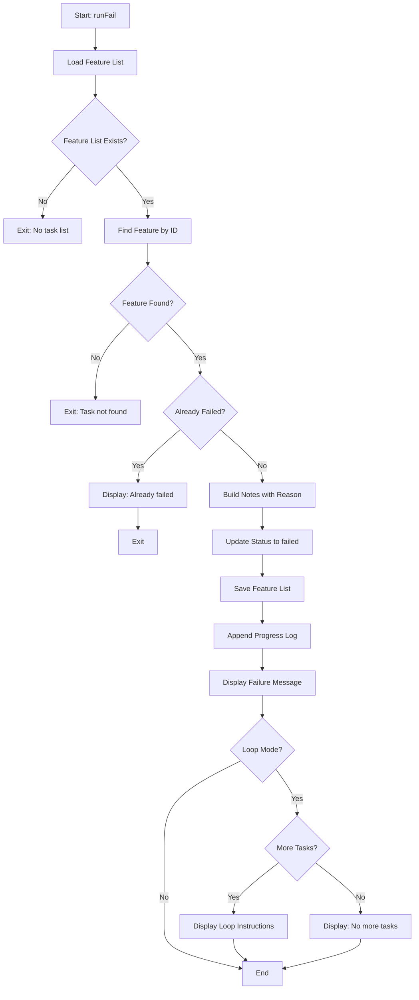
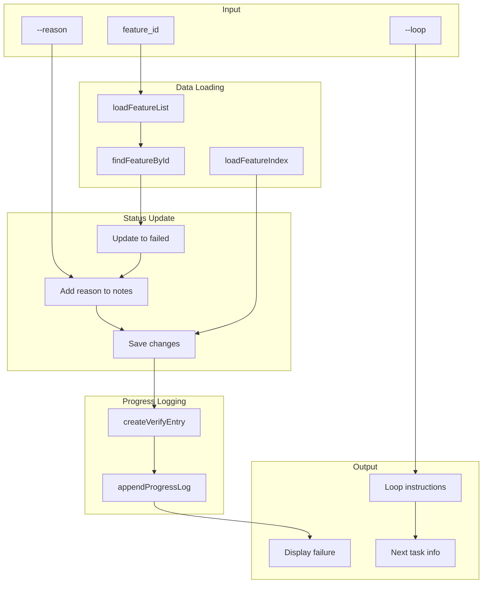
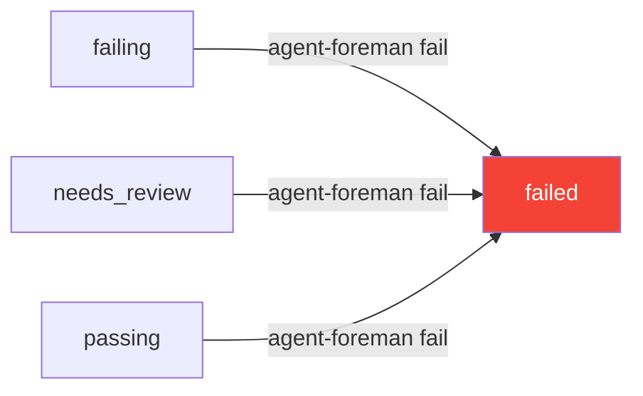

# fail Command

Mark a task/feature as failed with a reason.

## Command Syntax

```bash
agent-foreman fail <feature_id> [options]
```

## Description

The `fail` command marks a task as failed when verification fails and you want to continue to the next task. This is part of the AI agent loop workflow - instead of stopping on verification failure, mark the task as failed and proceed.

## Arguments

| Argument | Type | Required | Description |
|----------|------|----------|-------------|
| `feature_id` | string | Yes | Task ID to mark as failed |

## Options

| Option | Alias | Type | Default | Description |
|--------|-------|------|---------|-------------|
| `--reason` | `-r` | string | - | Reason for failure |
| `--loop` | - | boolean | `true` | Show next task instruction (use `--no-loop` to disable) |

## Execution Flow



## Data Flow Diagram



## Key Functions

### `runFail(featureId, reason, loopMode)`

**Location**: `src/commands/fail.ts:20`

Main entry point for the fail command.

**Parameters**:
- `featureId: string` - Task ID to mark as failed
- `reason?: string` - Optional failure reason
- `loopMode: boolean` - Whether to show loop continuation instructions

## Output Examples

### Basic Failure

```
✗ Marked 'auth.login' as failed
  Reason: Tests timeout after 30 seconds

══════════════════════════════════════════════════════════════
                   CONTINUE TO NEXT TASK
══════════════════════════════════════════════════════════════

   Failed: auth.login
   Next up: auth.logout
   Progress: 5/17 passing (29%)
   Failed tasks: 1

   LOOP INSTRUCTION:
   1. agent-foreman next
   2. Implement task
   3. agent-foreman check <task_id>
   4. agent-foreman done <task_id>
   5. REPEAT until all tasks processed

   ➤ Continue to the next task NOW.
══════════════════════════════════════════════════════════════
```

### Already Failed

```
⚠ Task 'auth.login' is already marked as failed.
  Previous reason: Verification failed: Tests timeout
```

## Use Cases

### After Verification Failure

```bash
# Verification failed
agent-foreman check auth.login
# Output: ✗ Verification failed...

# Mark as failed and continue
agent-foreman fail auth.login --reason "API endpoint not responding"
```

### In AI Agent Loop

```bash
# When verification fails during loop mode
agent-foreman done auth.login
# Output: ✗ Verification failed...
# Output: 2. Mark as failed: 'agent-foreman fail auth.login -r "reason"'

# Mark and continue
agent-foreman fail auth.login -r "Database schema mismatch"
# Continue with next task
agent-foreman next
```

### Without Loop Mode

```bash
# Just mark as failed without continuation instructions
agent-foreman fail auth.login --reason "Blocked by external API" --no-loop
```

## Status Transition



## Notes Field Format

When marked as failed, the notes field is updated:

```
Verification failed: <reason provided>
```

Or if no reason:
```
Marked as failed
```

## Error Handling

| Error | Cause | Resolution |
|-------|-------|------------|
| "No task list found" | Harness not initialized | Run `agent-foreman init` first |
| "Task not found" | Invalid feature ID | Check `agent-foreman status` for valid IDs |

## Related Commands

- [`done`](./done.md) - Mark task as complete (opposite action)
- [`check`](./check.md) - Verify task (may suggest using fail)
- [`next`](./next.md) - Get next task (failed tasks are excluded)
- [`status`](./status.md) - View all task statuses including failed
