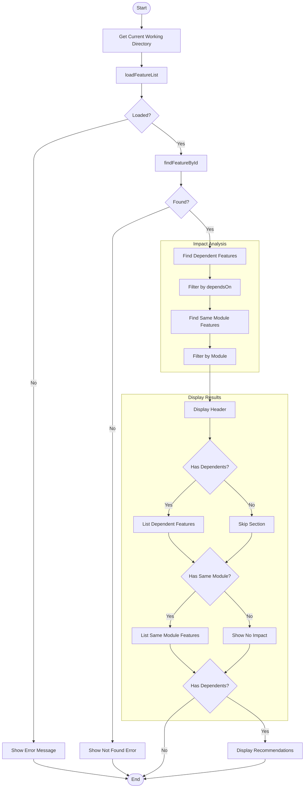
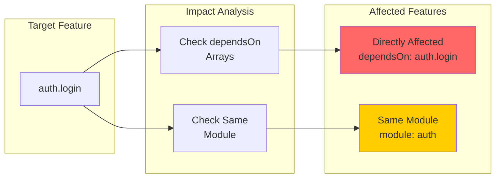
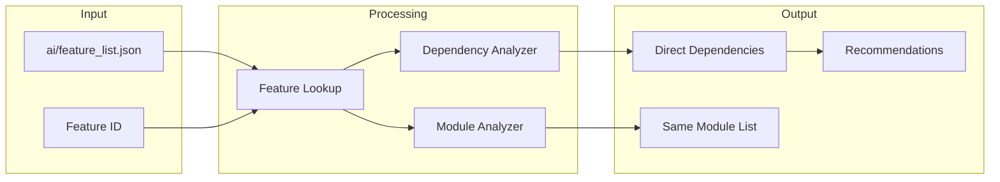
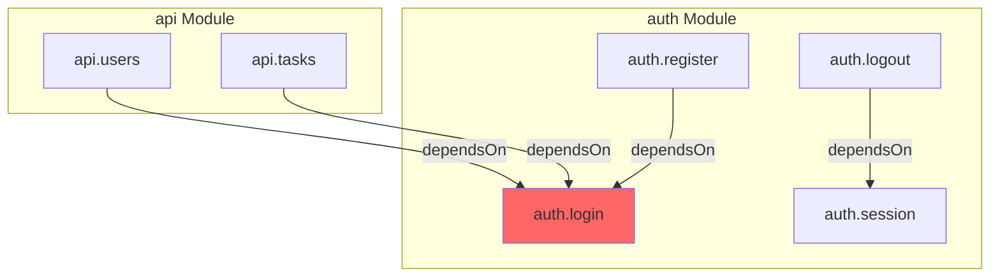
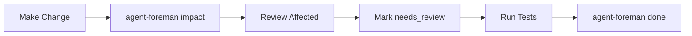

# impact Command

Analyze impact of changes to a feature on other features.

> 分析对功能的更改对其他功能的影响。

## Synopsis

```bash
agent-foreman impact <feature_id>
```

## Description

The `impact` command analyzes the dependency graph to identify features that may be affected by changes to a specific feature. It helps developers understand the ripple effects of modifications and plan testing accordingly.

> `impact` 命令分析依赖关系图，识别可能受特定功能更改影响的功能。它帮助开发者理解修改的连锁反应并相应地规划测试。

## Arguments

| Argument | Required | Description |
|----------|----------|-------------|
| `feature_id` | Yes | The feature to analyze impact for |

## Execution Flow



## Impact Detection Logic



### Directly Affected Features
Features that explicitly declare `dependsOn` containing the target feature ID. These are high-priority for review.

### Same Module Features
Features in the same module that might share code or state. These are recommended for review.

## Detailed Step-by-Step Flow

### 1. Load Feature List
- Load `ai/feature_list.json`
- Exit with error if not found

### 2. Find Target Feature
- Search for feature by ID
- Exit with error if not found

### 3. Analyze Dependencies

**Direct Dependencies:**
```javascript
// Find features where dependsOn includes target
const dependents = features.filter(f =>
  f.dependsOn.includes(featureId)
);
```

**Same Module:**
```javascript
// Find features in same module (excluding deprecated)
const sameModule = features.filter(f =>
  f.module === feature.module &&
  f.id !== featureId &&
  f.status !== 'deprecated'
);
```

### 4. Display Results
- Show directly affected features with their status
- Show same-module features (limit to 10, show count for more)
- If no impact, show "No other features appear to be affected"

### 5. Recommendations
If there are dependents:
1. Review and test dependent features
2. Mark uncertain features as `needs_review`
3. Update feature notes with impact details

## Data Flow Diagram



## Dependency Graph Visualization



When analyzing impact for `auth.login`:
- **Directly Affected**: `auth.register`, `api.users`, `api.tasks`
- **Same Module**: `auth.logout`, `auth.session`

## Dependencies

### Internal Modules
- `src/feature-list.ts` - Feature operations
  - `loadFeatureList()` - Load feature data
  - `findFeatureById()` - Find specific feature

### External Dependencies
- `chalk` - Console output styling

## Files Read

| File | Purpose |
|------|---------|
| `ai/feature_list.json` | Feature dependency graph |

## Files Written

None - this is a read-only analysis command.

## Exit Codes

| Code | Meaning |
|------|---------|
| 0 | Success (always) |

## Examples

### Basic Impact Analysis
```bash
# Analyze impact for auth.login feature
agent-foreman impact auth.login
```

### Chain Analysis
```bash
# Check multiple features
agent-foreman impact auth.login
agent-foreman impact auth.session
```

## Console Output Example

### With Dependencies
```
🔍 Impact Analysis: auth.login

   ⚠ Directly Affected Features:
   → auth.register (failing) - depends on this feature
   → api.users.create (passing) - depends on this feature
   → api.tasks.list (failing) - depends on this feature

   📁 Same Module (review recommended):
   → auth.logout (passing)
   → auth.session (failing)
   → auth.refresh-token (failing)

   Recommendations:
   1. Review and test dependent features
   2. Mark uncertain features as 'needs_review'
   3. Update feature notes with impact details
```

### No Dependencies
```
🔍 Impact Analysis: api.health

   ✓ No other features appear to be affected
```

### Large Module
```
🔍 Impact Analysis: ui.button

   📁 Same Module (review recommended):
   → ui.input (passing)
   → ui.select (passing)
   → ui.modal (failing)
   → ui.toast (passing)
   → ui.card (passing)
   → ui.tabs (failing)
   → ui.form (passing)
   → ui.table (passing)
   → ui.pagination (failing)
   → ui.dropdown (passing)
   ... and 5 more
```

## Use Cases

### Before Major Refactoring
```bash
# Check what might break
agent-foreman impact core.database
```

### After Bug Fix
```bash
# Verify dependent features still work
agent-foreman impact auth.validation
# Then run tests on affected features
```

### Planning Session Reviews
```bash
# Identify features to mark as needs_review
agent-foreman impact api.response-format
# Update their status
# features with dependsOn should be marked needs_review
```

## Workflow Integration



## Related Commands

- `agent-foreman status` - View overall status
- `agent-foreman next` - Get next feature
- `agent-foreman check` - Verify feature implementation
