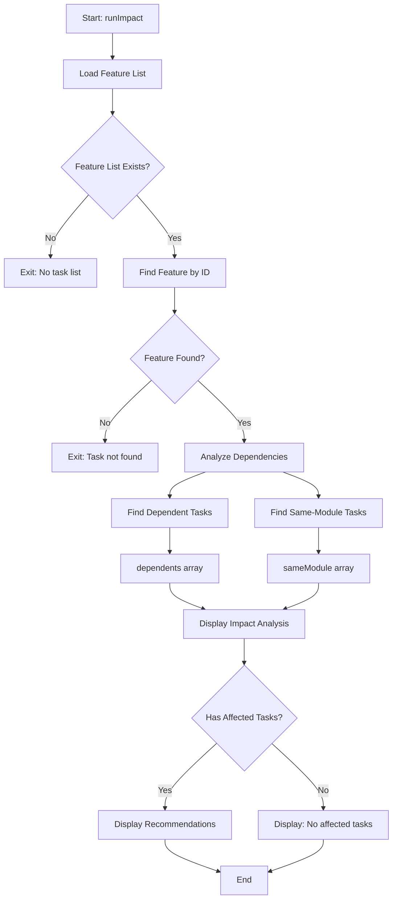
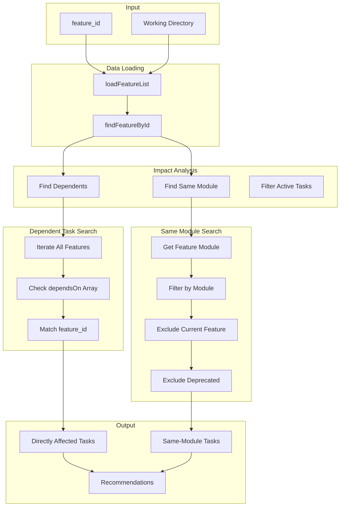
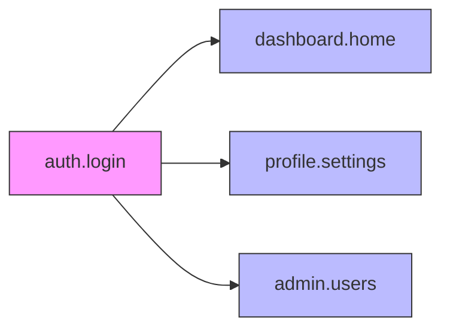
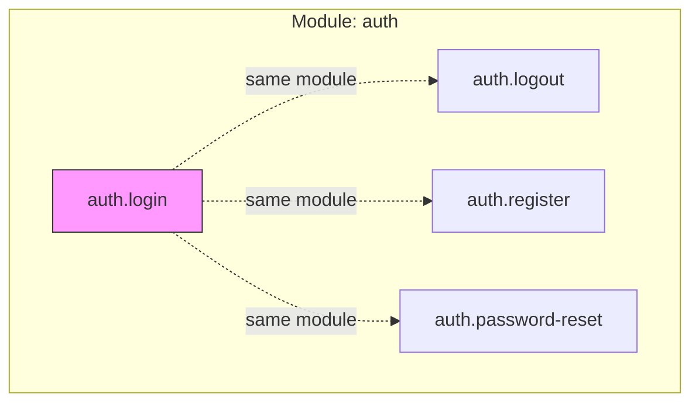
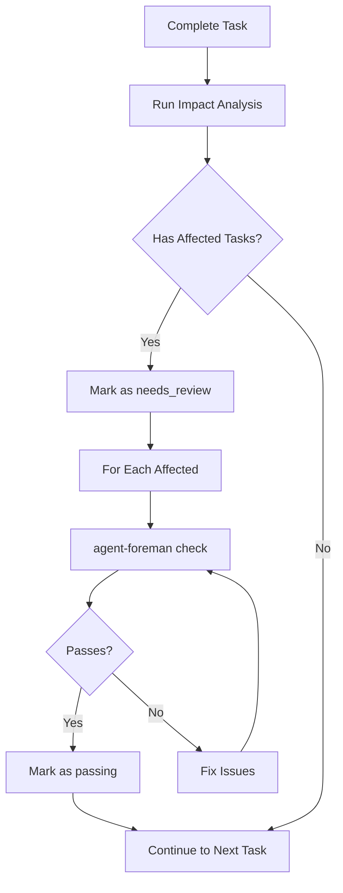

# impact Command

Analyze the impact of changes to a task/feature on other tasks.

## Command Syntax

```bash
agent-foreman impact <feature_id>
```

## Description

The `impact` command analyzes how changes to a specific task might affect other tasks in the project. It identifies directly dependent tasks and tasks in the same module that may need review.

## Arguments

| Argument | Type | Required | Description |
|----------|------|----------|-------------|
| `feature_id` | string | Yes | Task ID to analyze impact for |

## Execution Flow



## Data Flow Diagram



## Key Functions

### `runImpact(featureId)`

**Location**: `src/commands/impact.ts:12`

Main entry point for the impact command.

**Process**:
1. Loads the feature list
2. Finds the specified feature
3. Identifies all features that depend on this one
4. Identifies all features in the same module
5. Displays impact analysis with recommendations

## Dependency Analysis

The command identifies two types of related tasks:

### Directly Affected Tasks

Tasks that explicitly list the analyzed feature in their `dependsOn` array.



**Example**: If `auth.login` is modified, any task with `dependsOn: ["auth.login"]` is directly affected.

### Same-Module Tasks

Tasks in the same module that might be affected by shared code or patterns.



## Output Example

```
🔍 Impact Analysis: auth.login

   ⚠ Directly Affected Tasks:
   → dashboard.home (failing) - depends on this task
   → profile.settings (passing) - depends on this task
   → admin.users (needs_review) - depends on this task

   📁 Same Module (review recommended):
   → auth.logout (passing)
   → auth.register (failing)
   → auth.password-reset (blocked)
   → auth.session-refresh (failing)
   ... and 2 more

   💡 Recommendations:
   1. Review and test dependent tasks (highest priority)
   2. Mark uncertain dependent tasks as 'needs_review'
   3. Consider reviewing same-module tasks for side effects
   4. Update task notes with impact details
   5. Run 'agent-foreman check <task_id>' to verify affected tasks
```

## Recommendations Logic

Recommendations are generated based on findings:

| Condition | Recommendation |
|-----------|----------------|
| Has dependents | Review and test dependent tasks (highest priority) |
| Has dependents | Mark uncertain dependent tasks as 'needs_review' |
| Has same-module | Consider reviewing same-module tasks for side effects |
| Any affected | Update task notes with impact details |
| Any affected | Run `agent-foreman check` to verify affected tasks |

## Use Cases

### Before Making Changes

```bash
# Check what might be affected before modifying
agent-foreman impact auth.login
```

### After Completing a Task

```bash
# Identify tasks that might need review
agent-foreman done auth.login
agent-foreman impact auth.login
# Review/update dependent tasks
```

### During Refactoring

```bash
# Understand full impact of refactoring
agent-foreman impact core.utils
```

## Integration with Other Commands

### Workflow Example



## Limitations

1. **Static Analysis Only**: Does not analyze actual code dependencies
2. **Explicit Dependencies**: Only finds tasks with `dependsOn` declarations
3. **Module Heuristic**: Same-module analysis is a heuristic, not guarantee
4. **No Transitive Dependencies**: Does not trace chains of dependencies

## Best Practices

1. **Declare Dependencies**: Use `dependsOn` in feature definitions
2. **Module Organization**: Group related features in modules
3. **Regular Impact Checks**: Run after significant changes
4. **Update Status**: Mark affected tasks as `needs_review`

## Related Commands

- [`check`](./check.md) - Verify affected tasks
- [`done`](./done.md) - Complete tasks
- [`status`](./status.md) - View all task statuses
