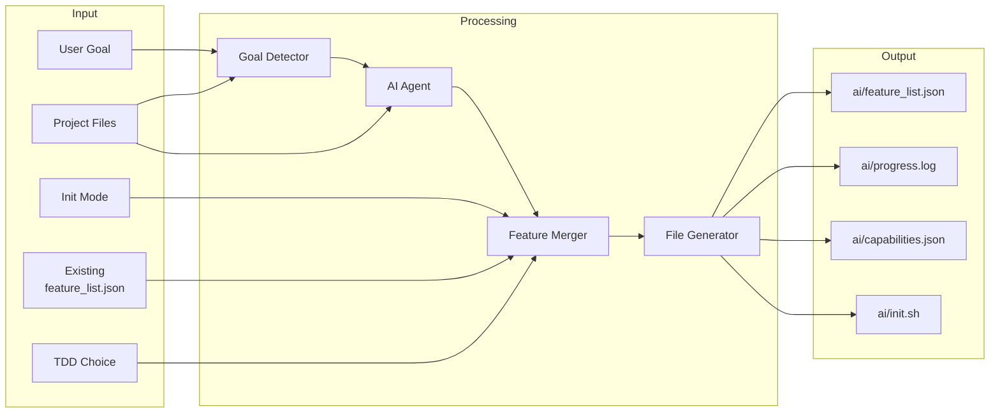
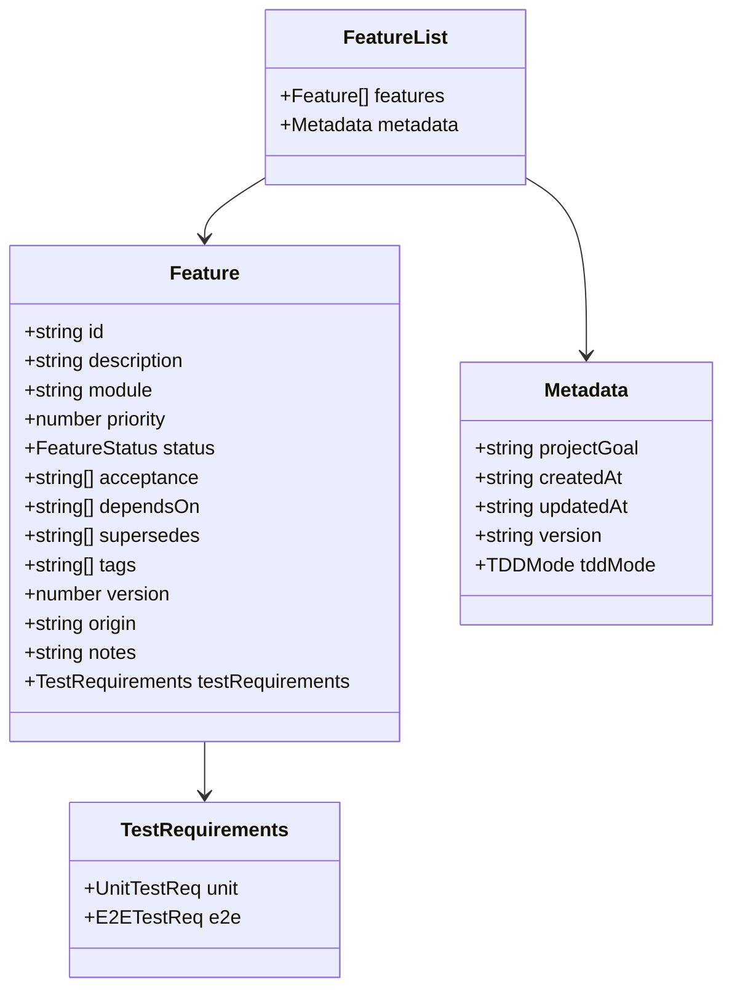

# init Command

Initialize or upgrade the long-task harness for a project.

> 为项目初始化或升级长任务工具包。

## Synopsis

```bash
agent-foreman init [goal] [options]
```

## Description

The `init` command sets up the agent-foreman harness in a project. It uses AI to analyze the project structure, detect features, and create the necessary configuration files for feature-driven development.

> `init` 命令在项目中设置 agent-foreman 工具包。它使用 AI 分析项目结构、检测功能，并创建功能驱动开发所需的配置文件。

## Arguments

| Argument | Description |
|----------|-------------|
| `goal` | Project goal (auto-detected from package.json/README if not provided) |

## Options

| Option | Alias | Default | Choices | Description |
|--------|-------|---------|---------|-------------|
| `--mode` | `-m` | `merge` | `merge`, `new`, `scan` | Init mode |
| `--verbose` | `-v` | `false` | - | Show detailed output |

### Mode Options

| Mode | Description |
|------|-------------|
| `merge` | Keep existing features, add newly discovered ones |
| `new` | Backup old list, create fresh feature list |
| `scan` | Preview only, no file modifications |

## Execution Flow

```mermaid
flowchart TD
    Start([Start]) --> GetCWD[Get Current Working Directory]
    GetCWD --> CheckGit{Is Git Repo?}

    CheckGit -->|No| InitGit[git init]
    InitGit --> GitSuccess{Success?}
    GitSuccess -->|No| GitError[Exit with Error]
    GitSuccess -->|Yes| Analyze
    CheckGit -->|Yes| Analyze

    subgraph Analysis["AI Analysis Phase"]
        Analyze[detectAndAnalyzeProject] --> DetectGoal{Goal Provided?}
        DetectGoal -->|No| AutoDetect[detectProjectGoal]
        AutoDetect --> AIAnalyze
        DetectGoal -->|Yes| AIAnalyze[AI Scan Project]
        AIAnalyze --> ParseSurvey[Parse Project Survey]
    end

    ParseSurvey --> CheckMode{Mode = scan?}
    CheckMode -->|Yes| SkipTDD[Skip TDD Prompt]
    CheckMode -->|No| TDDPrompt[Prompt TDD Mode]

    subgraph TDD["TDD Mode Selection"]
        TDDPrompt --> WaitInput{User Input<br/>within 10s?}
        WaitInput -->|Yes| ParseTDD[Parse Response]
        WaitInput -->|Timeout| DefaultTDD[Default: recommended]
        ParseTDD --> TDDMode[Set TDD Mode]
        DefaultTDD --> TDDMode
    end

    SkipTDD --> MergeFeatures
    TDDMode --> MergeFeatures

    subgraph Merge["Feature Processing"]
        MergeFeatures[mergeOrCreateFeatures] --> CheckMergeMode{Mode?}
        CheckMergeMode -->|merge| LoadExisting[Load Existing Features]
        LoadExisting --> MergeNew[Merge New Discoveries]
        CheckMergeMode -->|new| BackupOld[Backup Old List]
        BackupOld --> CreateFresh[Create Fresh List]
        CheckMergeMode -->|scan| PreviewOnly[Preview Only]
    end

    MergeNew --> GenerateFiles
    CreateFresh --> GenerateFiles
    PreviewOnly --> DisplayScan[Display Scan Results]
    DisplayScan --> End

    subgraph Generate["File Generation"]
        GenerateFiles[generateHarnessFiles] --> WriteFeatureList[Write ai/feature_list.json]
        WriteFeatureList --> WriteProgressLog[Write ai/progress.log]
        WriteProgressLog --> WriteCapabilities[Write ai/capabilities.json]
        WriteCapabilities --> WriteInitScript[Write ai/init.sh]
    end

    WriteInitScript --> ShowSuccess[Show Success Message]
    ShowSuccess --> CheckStrictTDD{TDD = strict?}
    CheckStrictTDD -->|Yes| ShowTDDWarning[Show TDD Warning]
    CheckStrictTDD -->|No| ShowNextStep
    ShowTDDWarning --> ShowNextStep[Show Next Steps]
    ShowNextStep --> End([End])

    GitError --> Exit([Exit 1])
```



## Detailed Step-by-Step Flow

### 1. Git Repository Check
- Check if current directory is a git repository
- If not, automatically initialize git (`git init`)
- Exit with error if git initialization fails

### 2. AI Analysis Phase
- Call `detectAndAnalyzeProject(cwd, goal, verbose)` from `src/init-helpers.ts`
- If no goal provided, auto-detect from:
  - `package.json` description
  - `README.md` content
- Spawn AI agent to analyze project:
  - Detect tech stack
  - Identify modules
  - Discover features (existing and potential)
  - Assess completion status

### 3. TDD Mode Selection
- Prompt user for TDD mode (10-second timeout)
- Options:
  - **strict**: Tests required for all features
  - **recommended**: Tests suggested but not required (default)
  - **disabled**: No TDD guidance
- Auto-select "recommended" on timeout

### 4. Feature Processing
Based on mode:

**Merge Mode (default)**:
- Load existing `ai/feature_list.json` if exists
- Merge newly discovered features
- Preserve existing feature status and notes
- Add new features with `failing` status

**New Mode**:
- Backup existing feature list (if any)
- Create fresh feature list from AI discoveries
- All features start with `failing` status

**Scan Mode**:
- Preview discovered features only
- No file modifications

### 5. File Generation
Generate harness files in `ai/` directory:

| File | Purpose |
|------|---------|
| `ai/feature_list.json` | Feature backlog with TDD mode |
| `ai/progress.log` | Progress tracking log |
| `ai/capabilities.json` | Project capabilities cache |
| `ai/init.sh` | Bootstrap script |

### 6. Completion
- Display success message
- If strict TDD mode, show enforcement warning
- Show next step instructions

## Data Flow Diagram



## Feature List Schema



## Dependencies

### Internal Modules
- `src/init-helpers.ts` - Multi-step init orchestration
  - `detectAndAnalyzeProject()` - AI-powered analysis
  - `mergeOrCreateFeatures()` - Feature processing
  - `generateHarnessFiles()` - File generation
- `src/git-utils.ts` - Git operations
  - `isGitRepo()` - Check git status
  - `gitInit()` - Initialize git repository
- `src/commands/helpers.ts` - Command helpers
  - `promptConfirmation()` - User prompts

### External Dependencies
- `chalk` - Console output styling
- `readline` - User input handling
- AI CLI tools: `claude`, `codex`, or `gemini`

## Files Read

| File | Purpose |
|------|---------|
| `ai/feature_list.json` | Existing features (merge mode) |
| `package.json` | Project metadata, goal detection |
| `README.md` | Project description |
| Source files | Feature detection |

## Files Written

| File | Purpose |
|------|---------|
| `ai/feature_list.json` | Feature backlog |
| `ai/progress.log` | Progress tracking |
| `ai/capabilities.json` | Capabilities cache |
| `ai/init.sh` | Bootstrap script |

## Exit Codes

| Code | Meaning |
|------|---------|
| 0 | Success |
| 1 | AI analysis failed / Git init failed |

## Examples

### Basic Initialization
```bash
# Auto-detect goal and initialize
agent-foreman init
```

### Custom Goal
```bash
# Provide explicit project goal
agent-foreman init "Build a task management API"
```

### Merge Mode (Default)
```bash
# Preserve existing features, add new discoveries
agent-foreman init -m merge
```

### Fresh Start
```bash
# Create new feature list, backup existing
agent-foreman init -m new
```

### Preview Only
```bash
# See what would be discovered without changes
agent-foreman init -m scan
```

### Verbose Output
```bash
# Show detailed analysis progress
agent-foreman init -v
```

## Console Output Example

```
🚀 Initializing harness (mode: merge)...
  Analyzing project...
✓ AI analysis successful (agent: claude)
  Found 12 features

📋 TDD Mode Configuration
   Strict mode requires tests for all features.
   The 'check' and 'done' commands will fail without tests.
   (Auto-skip in 10s with default: recommended)

   Enable strict TDD mode? (tests required for all features) [y/N]: y
   ✓ Strict TDD mode enabled

🎉 Harness initialized successfully!

!!! STRICT TDD MODE ENABLED !!!
   All features require tests to pass verification.
   Write tests BEFORE implementation (RED → GREEN → REFACTOR).

Next: Run 'agent-foreman next' to start working on features
```

## TDD Mode Impact

| Mode | check Command | done Command | Feature Requirements |
|------|--------------|--------------|---------------------|
| `strict` | Blocks without tests | Blocks without tests | `testRequirements.unit.required: true` |
| `recommended` | Warning only | Warning only | Tests suggested |
| `disabled` | No TDD checks | No TDD checks | No requirements |

## Related Commands

- `agent-foreman analyze` - Generate architecture report
- `agent-foreman next` - Get next feature to work on
- `agent-foreman status` - View project status
- `agent-foreman scan` - Scan project capabilities
