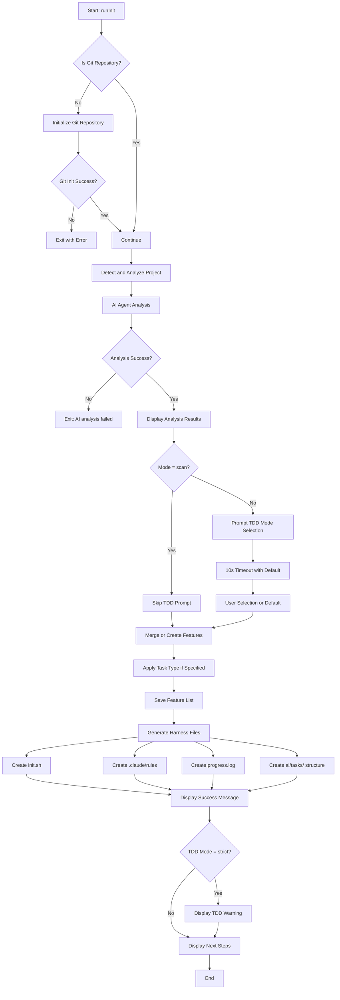
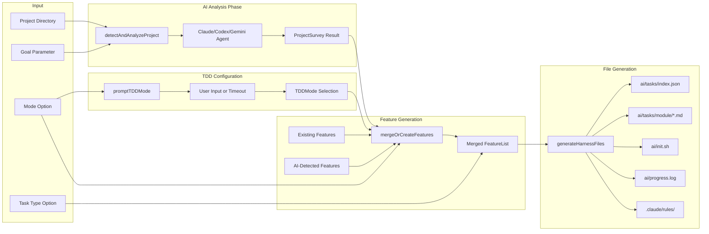

# init Command

Initialize or upgrade the long-task harness for AI-driven development.

## Command Syntax

```bash
agent-foreman init [goal] [options]
```

## Description

The `init` command sets up the agent-foreman harness in a project. It performs AI-powered project analysis, generates a task list, and creates the necessary infrastructure files for task-driven development.

## Arguments

| Argument | Type | Required | Description |
|----------|------|----------|-------------|
| `goal` | string | No | Project goal description. Auto-detected from package.json or README if not provided |

## Options

| Option | Alias | Type | Default | Description |
|--------|-------|------|---------|-------------|
| `--mode` | `-m` | string | `merge` | Init mode: `merge`, `new`, or `scan` |
| `--task-type` | `-t` | string | - | Default verification type: `code`, `ops`, `data`, `infra`, `manual` |
| `--verbose` | `-v` | boolean | `false` | Show detailed output |

### Init Modes

- **merge**: Combines AI-detected features with existing features (default)
- **new**: Creates a fresh feature list from AI analysis, discarding existing
- **scan**: Only scans project capabilities without generating features

### Task Types

- **code**: Software development tasks (unit tests, build verification)
- **ops**: Operational tasks (manual checklist verification)
- **data**: Data processing tasks (output validation)
- **infra**: Infrastructure tasks (resource state checks)
- **manual**: Manual verification only (no automation)

## Execution Flow



## Data Flow Diagram



## Key Functions

### `runInit(goal, mode, verbose, taskType?, options?)`

**Location**: `src/commands/init.ts:201`

Main entry point for the init command.

**Parameters**:
- `goal: string` - Project goal description
- `mode: InitMode` - Init mode (merge/new/scan)
- `verbose: boolean` - Enable verbose output
- `taskType?: TaskType` - Optional default task type
- `options?: InitOptions` - Optional analyze/scan mode options

**Process**:
1. Verify/initialize git repository
2. Run AI project analysis
3. Prompt for TDD mode (interactive with 10s timeout)
4. Generate/merge features based on mode
5. Apply task type to all features
6. Generate harness infrastructure files

### `promptTDDMode()`

**Location**: `src/commands/init.ts:41`

Interactive TDD mode selection with timeout.

**Returns**: `Promise<TDDMode | undefined>`

**Options**:
- `[1] Strict` - Tests REQUIRED before marking tasks done
- `[2] Recommended` - Tests suggested but optional (default)
- `[3] Disabled` - No TDD guidance or enforcement

**Timeout**: 10 seconds, defaults to "recommended"

### `detectAndAnalyzeProject(cwd, goal, verbose)`

**Location**: `src/init/index.ts`

AI-powered project analysis using Claude, Codex, or Gemini.

**Returns**: `{ success: boolean, survey?: ProjectSurvey, agentUsed?: string, error?: string }`

### `mergeOrCreateFeatures(cwd, survey, goal, mode, verbose, tddMode)`

**Location**: `src/init/index.ts`

Generates or merges feature list based on mode.

**Returns**: `FeatureList`

### `generateHarnessFiles(cwd, survey, featureList, goal, mode)`

**Location**: `src/init/index.ts`

Creates all harness infrastructure files.

## Output Files

| File | Purpose |
|------|---------|
| `ai/tasks/index.json` | Lightweight task index for quick lookups |
| `ai/tasks/{module}/{id}.md` | Individual task definitions in Markdown |
| `ai/init.sh` | Bootstrap script with check/dev/bootstrap modes |
| `ai/progress.log` | Session handoff audit log |
| `.claude/rules/` | Rule files for Claude Code integration |

## Examples

### Basic Initialization

```bash
# Auto-detect goal and merge with existing features
agent-foreman init

# Specify goal explicitly
agent-foreman init "Build a REST API for user management"

# Start fresh with new feature list
agent-foreman init --mode new

# Only scan capabilities
agent-foreman init --mode scan
```

### With Task Type

```bash
# Initialize for infrastructure project
agent-foreman init "Deploy Kubernetes cluster" --task-type infra

# Initialize for operational tasks
agent-foreman init "Set up monitoring" --task-type ops
```

### Verbose Output

```bash
agent-foreman init -v
```

## TDD Mode Behavior

### Strict Mode

When TDD mode is set to `strict`:
- All features require tests to pass verification
- `agent-foreman check` and `done` commands will fail without test files
- TDD workflow guidance is displayed prominently
- Features auto-migrate to `testRequirements.unit.required: true`

### Recommended Mode (Default)

- TDD guidance is shown but not enforced
- Tests are suggested but optional
- Verification succeeds even without test files

### Disabled Mode

- No TDD guidance displayed
- Useful for legacy projects or non-code tasks

## Error Handling

| Error | Cause | Resolution |
|-------|-------|------------|
| "AI analysis failed" | No AI agent available | Install gemini, codex, or claude CLI |
| "Failed to initialize git" | Git not installed or permission issue | Install git or check permissions |

## Related Commands

- [`next`](./next.md) - Get next task to work on
- [`status`](./status.md) - View project status
- [`agents`](./agents.md) - Show AI agent status

**Note**: `scan` and `analyze` are flags of the `init` command:
- `agent-foreman init --scan` - Scan project capabilities
- `agent-foreman init --analyze` - Generate architecture analysis
