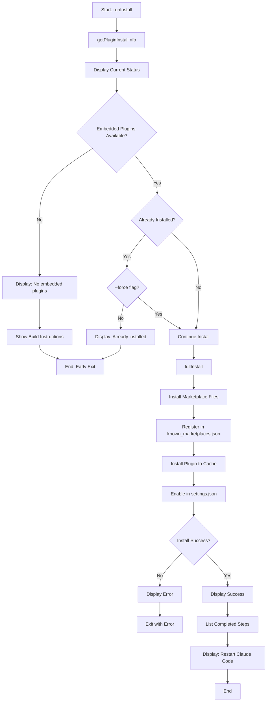
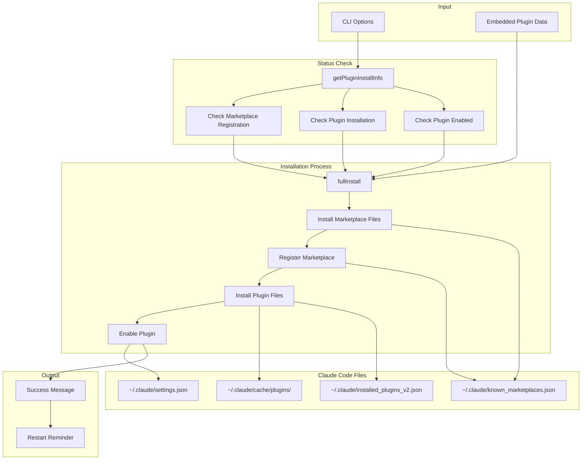

# install Command

Install the agent-foreman Claude Code plugin.

## Command Syntax

```bash
agent-foreman install [options]
```

## Description

The `install` command installs the agent-foreman plugin for Claude Code, enabling slash commands and skills integration. It registers the marketplace, installs plugin files, and enables the plugin in Claude Code settings.

## Options

| Option | Alias | Type | Default | Description |
|--------|-------|------|---------|-------------|
| `--force` | `-f` | boolean | `false` | Force reinstall even if already installed |

## Execution Flow



## Data Flow Diagram



## Installation Steps

### 1. Marketplace Files Installation

Copies plugin marketplace files to Claude Code's known marketplace location.

```
~/.claude/marketplaces/agent-foreman/
├── marketplace.json
├── plugin.json
└── README.md
```

### 2. Marketplace Registration

Adds entry to `~/.claude/known_marketplaces.json`:

```json
{
  "marketplaces": [
    {
      "name": "agent-foreman",
      "url": "file:///path/to/marketplace"
    }
  ]
}
```

### 3. Plugin Installation

Copies plugin files to cache:

```
~/.claude/cache/plugins/agent-foreman@agent-foreman-plugins/
├── plugin.json
├── commands/
├── skills/
└── ...
```

Updates `~/.claude/installed_plugins_v2.json`:

```json
{
  "plugins": [
    {
      "id": "agent-foreman:agent-foreman",
      "version": "0.1.91",
      "enabled": true
    }
  ]
}
```

### 4. Plugin Enablement

Updates `~/.claude/settings.json`:

```json
{
  "enabledPlugins": [
    "agent-foreman:agent-foreman"
  ]
}
```

## Key Functions

### `runInstall(force)`

**Location**: `src/commands/install.ts:18`

Main entry point for the install command.

### `getPluginInstallInfo()`

**Location**: `src/plugin-installer.ts`

Gets current installation status.

**Returns**:
```typescript
interface PluginInstallInfo {
  bundledVersion: string;
  installedVersion: string | null;
  isMarketplaceRegistered: boolean;
  isPluginInstalled: boolean;
  isPluginEnabled: boolean;
}
```

### `hasEmbeddedPlugins()`

**Location**: `src/plugin-installer.ts`

Checks if embedded plugins are available.

**Returns**: `boolean`

### `fullInstall()`

**Location**: `src/plugin-installer.ts`

Performs complete installation process.

## Output Example

```
Agent Foreman Plugin Installer
────────────────────────────────────────

Plugin Status:
  Version:     0.1.91
  Marketplace: ✓ registered
  Plugin:      ✓ installed (0.1.91)
  Enabled:     ✓ yes

✓ Plugin is already installed and enabled
  Use --force to reinstall

To manage the plugin:
  /plugin                    # Browse plugins
  agent-foreman uninstall    # Remove plugin
```

### Fresh Installation

```
Agent Foreman Plugin Installer
────────────────────────────────────────

Plugin Status:
  Version:     0.1.91
  Marketplace: not registered
  Plugin:      not installed
  Enabled:     no

Installing plugin...

✓ Plugin installed successfully!

Steps completed:
  1. Installed marketplace files
  2. Registered in known_marketplaces.json
  3. Installed plugin to cache
  4. Enabled in settings.json

⚡ Restart Claude Code to use the plugin
```

### No Embedded Plugins

```
Agent Foreman Plugin Installer
────────────────────────────────────────

Plugin Status:
  Version:     0.1.91
  Marketplace: not registered
  Plugin:      not installed
  Enabled:     no

⚠ No embedded plugins available
  Plugin install requires embedded plugins from a build process.
  For development, plugins are loaded directly from source.

To build with embedded plugins:
  npm run build          # Build npm package with plugins
  npm run build:bin      # Build standalone binary with plugins

Or install from GitHub:
  /plugin marketplace add mylukin/agent-foreman
  /plugin install agent-foreman:agent-foreman
```

## Examples

### Basic Installation

```bash
# Install the plugin
agent-foreman install
```

### Force Reinstall

```bash
# Reinstall even if already installed
agent-foreman install --force
```

## Plugin Features

After installation, the plugin provides:

### Slash Commands

- `/agent-foreman:init` - Initialize harness
- `/agent-foreman:next` - Get next task
- `/agent-foreman:status` - View status
- `/agent-foreman:run` - Run tasks
- `/agent-foreman:analyze` - Analyze project

### Skills

- `agent-foreman:init-harness` - Initialize harness skill
- `agent-foreman:project-analyze` - Project analysis skill
- `agent-foreman:feature-next` - Next task skill
- `agent-foreman:feature-run` - Run tasks skill

## Error Handling

| Error | Cause | Resolution |
|-------|-------|------------|
| "No embedded plugins" | Dev mode or incomplete build | Run `npm run build` |
| "Failed to install" | Permission or file issue | Check Claude Code directory permissions |

## Related Commands

- [`uninstall`](./uninstall.md) - Remove the plugin
