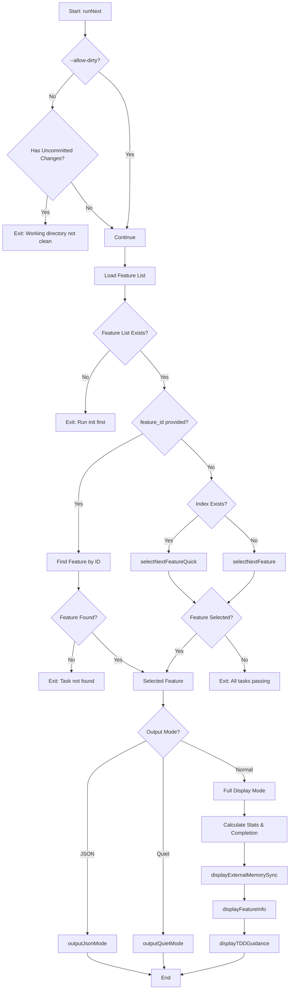
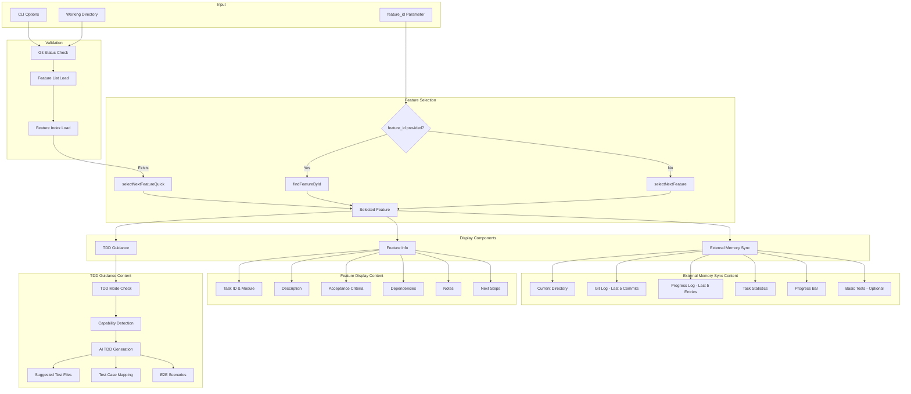
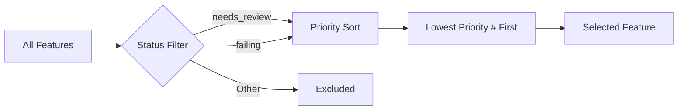
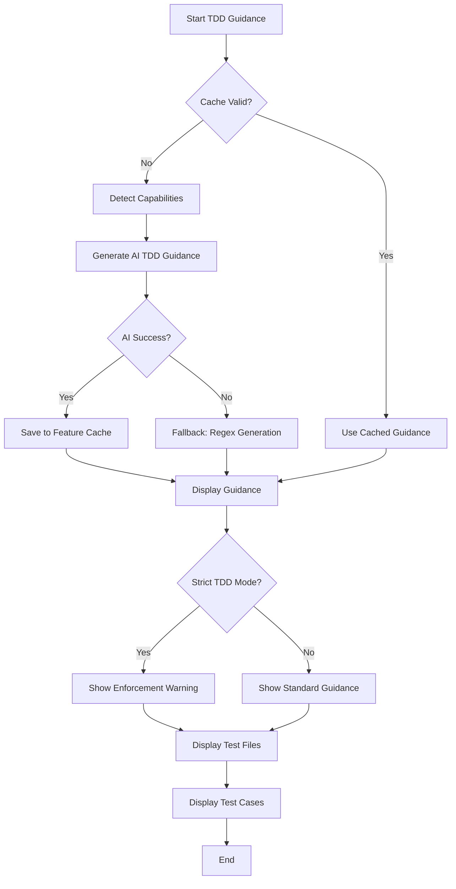

# next Command

Show the next task to work on or display details of a specific task.

## Command Syntax

```bash
agent-foreman next [feature_id] [options]
```

## Description

The `next` command selects and displays the highest priority task that needs attention, or shows details for a specific task if an ID is provided. It includes external memory synchronization (git history, progress log) and TDD guidance.

## Arguments

| Argument | Type | Required | Description |
|----------|------|----------|-------------|
| `feature_id` | string | No | Specific task ID to display. If omitted, auto-selects next priority task |

## Options

| Option | Alias | Type | Default | Description |
|--------|-------|------|---------|-------------|
| `--dry-run` | `-d` | boolean | `false` | Show plan without making changes |
| `--check` | `-c` | boolean | `false` | Run basic tests before showing next task |
| `--allow-dirty` | - | boolean | `false` | Allow running with uncommitted changes |
| `--json` | - | boolean | `false` | Output as JSON for scripting |
| `--quiet` | `-q` | boolean | `false` | Suppress decorative output |
| `--refresh-guidance` | - | boolean | `false` | Force regenerate TDD guidance (ignore cache) |

## Execution Flow



## Data Flow Diagram



## Feature Selection Priority

Tasks are selected in this order:

1. **Status Priority**: `needs_review` > `failing`
   - Other statuses (`passing`, `blocked`, `deprecated`, `failed`) are excluded
2. **Priority Number**: Lower number = higher priority (1 is highest)



## Key Functions

### `runNext(featureId, dryRun, runCheck, allowDirty, outputJson, quiet, refreshGuidance)`

**Location**: `src/commands/next.ts:29`

Main entry point for the next command.

**Parameters**:
- `featureId?: string` - Optional specific task ID
- `dryRun: boolean` - Show without changes
- `runCheck: boolean` - Run tests first
- `allowDirty: boolean` - Skip uncommitted changes check
- `outputJson: boolean` - JSON output mode
- `quiet: boolean` - Minimal output
- `refreshGuidance: boolean` - Force regenerate TDD guidance

### `displayExternalMemorySync(cwd, stats, completion, runCheck)`

**Location**: `src/commands/next-display.ts:27`

Displays the external memory synchronization section:
- Current working directory
- Recent git commits (last 5)
- Recent progress log entries (last 5)
- Task status breakdown
- Progress bar visualization
- Optional: Run basic tests via `ai/init.sh check`

### `displayFeatureInfo(feature, dryRun)`

**Location**: `src/commands/next-display.ts:124`

Displays task information:
- Task ID, module, priority, status
- Full description
- Numbered acceptance criteria
- Dependencies (if any)
- Implementation notes (if any)
- Next steps guidance

### `displayTDDGuidance(cwd, feature, refreshGuidance, metadata)`

**Location**: `src/commands/next-display.ts:173`

Displays TDD guidance section:
- Checks TDD mode (strict/recommended/disabled)
- Uses cached guidance if valid
- Generates new AI guidance if needed
- Falls back to regex-based guidance
- Shows suggested test files
- Shows unit test cases and E2E scenarios

## Output Modes

### Normal Mode (Default)

Full decorated output with:
- External memory sync section
- Task info section
- TDD guidance section

### JSON Mode (`--json`)

```json
{
  "feature": {
    "id": "auth.login",
    "description": "User can log in",
    "module": "auth",
    "priority": 1,
    "status": "failing",
    "acceptance": ["..."],
    "dependsOn": [],
    "notes": null
  },
  "stats": {
    "passing": 5,
    "failing": 10,
    "needsReview": 2,
    "total": 17
  },
  "completion": 29,
  "cwd": "/path/to/project",
  "tddGuidance": { ... }
}
```

### Quiet Mode (`--quiet`)

```
Task: auth.login
Description: User can log in
Status: failing
Acceptance:
  1. User enters valid credentials and is logged in
  2. Invalid credentials show error message
```

## TDD Guidance Generation



## Examples

### Auto-Select Next Task

```bash
# Get the highest priority pending task
agent-foreman next
```

### Specific Task

```bash
# Get details for a specific task
agent-foreman next auth.login
```

### With Tests

```bash
# Run basic tests before showing next task
agent-foreman next --check
```

### JSON Output

```bash
# Output as JSON for scripting
agent-foreman next --json | jq '.feature.id'
```

### Force TDD Guidance Refresh

```bash
# Regenerate TDD guidance ignoring cache
agent-foreman next auth.login --refresh-guidance
```

### Allow Dirty Working Directory

```bash
# Skip uncommitted changes check
agent-foreman next --allow-dirty
```

## Error Handling

| Error | Cause | Resolution |
|-------|-------|------------|
| "Working directory not clean" | Uncommitted git changes | Commit or stash changes, or use `--allow-dirty` |
| "No task list found" | Harness not initialized | Run `agent-foreman init` first |
| "Task not found" | Invalid feature ID | Check available tasks with `agent-foreman status` |
| "All tasks passing" | No pending tasks | All work complete! |

## Related Commands

- [`init`](./init.md) - Initialize the harness
- [`status`](./status.md) - View all tasks status
- [`check`](./check.md) - Verify task implementation
- [`done`](./done.md) - Mark task as complete
