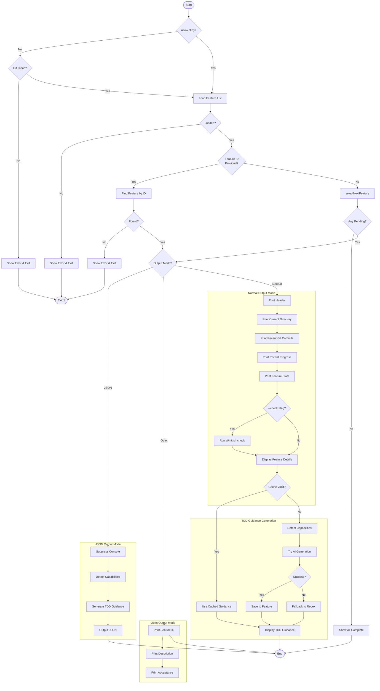
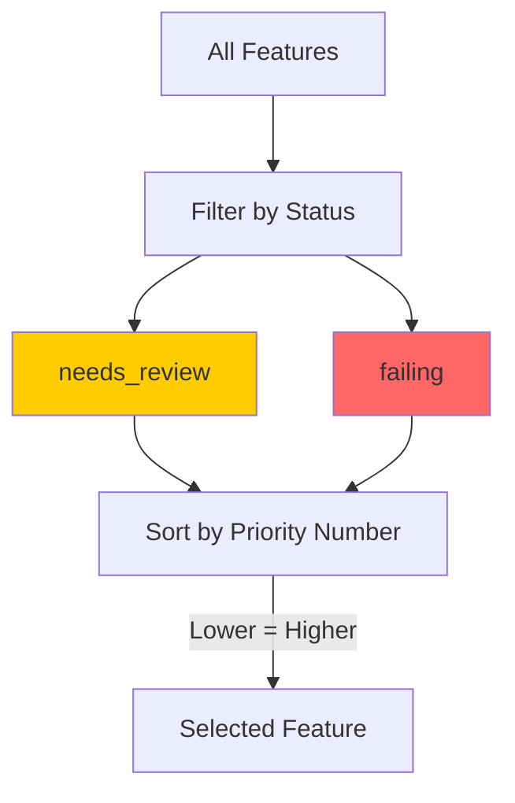
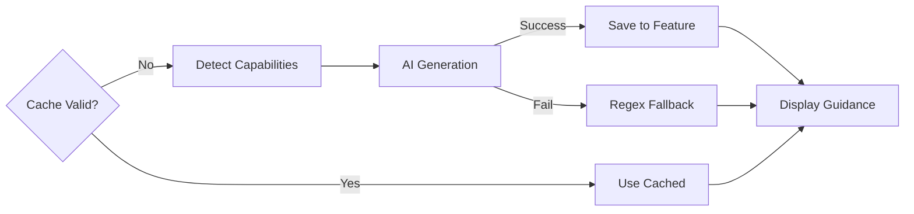
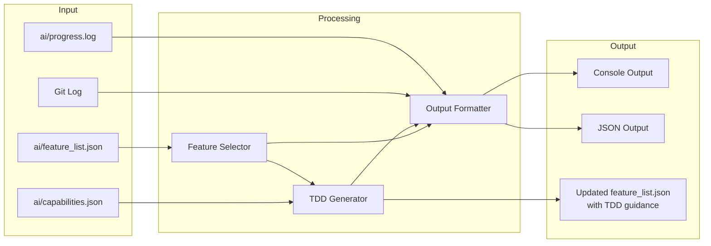

# next Command

Show next feature to work on or specific feature details with TDD guidance.

> 显示下一个要处理的功能或特定功能的详情及 TDD 指导。

## Synopsis

```bash
agent-foreman next [feature_id] [options]
```

## Description

The `next` command displays the next feature to implement based on priority order. It provides comprehensive context including git history, progress log, feature statistics, and AI-generated TDD guidance. When a specific feature ID is provided, it shows details for that feature instead of auto-selecting.

> `next` 命令根据优先级顺序显示下一个要实现的功能。它提供全面的上下文，包括 git 历史、进度日志、功能统计和 AI 生成的 TDD 指导。当提供特定功能 ID 时，它会显示该功能的详细信息而不是自动选择。

## Arguments

| Argument | Description |
|----------|-------------|
| `feature_id` | (Optional) Specific feature to display |

## Options

| Option | Alias | Default | Description |
|--------|-------|---------|-------------|
| `--dry-run` | `-d` | `false` | Show plan without changes |
| `--check` | `-c` | `false` | Run basic tests before showing next |
| `--allow-dirty` | - | `false` | Allow running with uncommitted changes |
| `--json` | - | `false` | Output as JSON for scripting |
| `--quiet` | `-q` | `false` | Suppress decorative output |
| `--refresh-guidance` | - | `false` | Force regenerate TDD guidance (ignore cache) |

## Execution Flow



## Feature Selection Priority



Priority order:
1. **Status first**: `needs_review` > `failing` (other statuses excluded)
2. **Then priority number**: Lower number = higher priority (1 is highest)

## Detailed Step-by-Step Flow

### 1. Clean Working Directory Check
- If not `--allow-dirty`, verify git working directory is clean
- Error if uncommitted changes exist (prevents context confusion)

### 2. Load Feature List
- Load `ai/feature_list.json`
- Validate against schema
- Auto-migrate to strict TDD if enabled

### 3. Feature Selection
**If feature_id provided:**
- Find feature by ID using `findFeatureById()`
- Error if not found

**If no feature_id:**
- Call `selectNextFeature()` to auto-select:
  - Filter features with status `needs_review` or `failing`
  - Sort by status priority, then by priority number

### 4. Output Generation

**JSON Mode (`--json`):**
- Suppress all console output
- Detect capabilities quietly
- Generate TDD guidance
- Output structured JSON object

**Quiet Mode (`--quiet`):**
- Minimal output: ID, description, status, acceptance criteria

**Normal Mode:**
- **External Memory Sync Section:**
  - Current working directory
  - Recent git commits (last 5)
  - Recent progress log entries (last 5)
  - Feature statistics with progress bar
- **Optional Test Check** (if `--check`):
  - Run `ai/init.sh check`
  - Show pass/fail status
- **Feature Details Section:**
  - Feature ID, module, priority, status
  - Description
  - Acceptance criteria
  - Dependencies (if any)
  - Notes (if any)
- **Next Actions:**
  - Show `check` and `done` command examples
- **TDD Guidance Section:**
  - TDD enforcement warning (if strict mode)
  - Suggested test files
  - Test cases with assertions
  - E2E scenarios (if applicable)

### 5. TDD Guidance Generation



Guidance includes:
- Suggested test file paths (unit and E2E)
- Unit test cases with assertions
- E2E scenarios with steps
- Test skeleton preview (for supported frameworks)

## Data Flow Diagram



## JSON Output Schema

```json
{
  "feature": {
    "id": "string",
    "description": "string",
    "module": "string",
    "priority": "number",
    "status": "string",
    "acceptance": ["string"],
    "dependsOn": ["string"],
    "notes": "string | null"
  },
  "stats": {
    "passing": "number",
    "failing": "number",
    "needsReview": "number",
    "total": "number"
  },
  "completion": "number",
  "cwd": "string",
  "tddGuidance": {
    "suggestedTestFiles": {
      "unit": ["string"],
      "e2e": ["string"]
    },
    "unitTestCases": [{
      "name": "string",
      "assertions": ["string"]
    }],
    "e2eScenarios": [{
      "name": "string",
      "steps": ["string"]
    }]
  }
}
```

## Dependencies

### Internal Modules
- `src/feature-list.ts` - Feature operations
  - `loadFeatureList()`, `saveFeatureList()`
  - `selectNextFeature()`, `findFeatureById()`
  - `getFeatureStats()`, `getCompletionPercentage()`
- `src/progress-log.ts` - Progress tracking
  - `getRecentEntries()`
- `src/capabilities/index.ts` - Capability detection
  - `detectCapabilities()`
- `src/tdd-guidance/index.ts` - TDD guidance generation
  - `generateTDDGuidance()`
- `src/tdd-ai-generator.ts` - AI-powered guidance
  - `generateTDDGuidanceWithAI()`
- `src/git-utils.ts` - Git operations
  - `isGitRepo()`, `hasUncommittedChanges()`

### External Dependencies
- `chalk` - Console output styling
- `child_process` - Git command execution

## Files Read

| File | Purpose |
|------|---------|
| `ai/feature_list.json` | Feature backlog |
| `ai/progress.log` | Recent activity |
| `ai/capabilities.json` | Test framework detection |
| `.git/` | Git status and history |

## Files Written

| File | Purpose |
|------|---------|
| `ai/feature_list.json` | Cache TDD guidance in feature |

## Exit Codes

| Code | Meaning |
|------|---------|
| 0 | Success (or all features complete) |
| 1 | Working directory not clean / Feature not found / No feature list |

## Examples

### Auto-Select Next Feature
```bash
# Get highest priority pending feature
agent-foreman next
```

### Specific Feature
```bash
# Get details for specific feature
agent-foreman next auth.login
```

### JSON Output for Scripting
```bash
# Output as JSON
agent-foreman next --json | jq '.feature.id'
```

### Allow Dirty Working Directory
```bash
# Bypass clean directory check
agent-foreman next --allow-dirty
```

### Refresh TDD Guidance
```bash
# Force regenerate guidance (ignore cache)
agent-foreman next auth.login --refresh-guidance
```

### Run Tests Before Showing
```bash
# Run basic checks first
agent-foreman next --check
```

## Console Output Example

```
═══════════════════════════════════════════════════════════════
                    EXTERNAL MEMORY SYNC
═══════════════════════════════════════════════════════════════

📁 Current Directory:
   /Users/dev/my-project

📜 Recent Git Commits:
   abc1234 feat(auth): add login endpoint
   def5678 fix(api): handle timeout errors
   ghi9012 docs: update README

📝 Recent Progress:
   2024-01-15 10:30 [STEP] Completed auth.login
   2024-01-15 09:15 [INIT] Initialized harness

📊 Feature Status:
   ✓ Passing: 5 | ✗ Failing: 7 | ⚠ Review: 2 | Blocked: 1
   Progress: [████████░░░░░░░░░░░░░░░░░░░░░░] 33%

═══════════════════════════════════════════════════════════════
                     NEXT TASK
═══════════════════════════════════════════════════════════════

📋 Feature: auth.register
   Module: auth | Priority: 2
   Status: failing

   Description:
   User registration with email verification

   Acceptance Criteria:
   1. User can register with email and password
   2. Validation errors display correctly
   3. Confirmation email is sent

═══════════════════════════════════════════════════════════════
   When done:
     1. Verify:   agent-foreman check auth.register
     2. Complete: agent-foreman done auth.register
═══════════════════════════════════════════════════════════════

!!! TDD ENFORCEMENT ACTIVE !!!
   Tests are REQUIRED for this feature to pass verification.
   The 'check' and 'done' commands will fail without tests.

═══════════════════════════════════════════════════════════════
                    TDD GUIDANCE (REQUIRED)
═══════════════════════════════════════════════════════════════

   (AI-generated by claude)

📝 Suggested Test Files:
   Unit: tests/auth/register.test.ts
   E2E:  e2e/auth/register.spec.ts

📋 Unit Test Cases:
   1. should register user with valid email and password
      → expect user to be created in database
      → expect password to be hashed
   2. should return validation errors for invalid input
      → expect error for invalid email format
      → expect error for weak password
   3. should send confirmation email after registration
      → expect email service to be called
      → expect email to contain verification link

🎭 E2E Scenarios:
   1. user completes registration flow
      → navigate to registration page
      → fill in email and password
      → submit form
      → ... 2 more steps

═══════════════════════════════════════════════════════════════
```

## Related Commands

- `agent-foreman status` - View overall project status
- `agent-foreman check` - Verify feature implementation
- `agent-foreman done` - Mark feature as complete
- `agent-foreman impact` - Analyze feature dependencies
