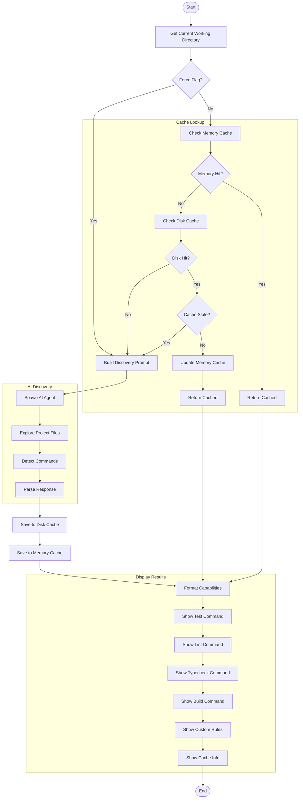
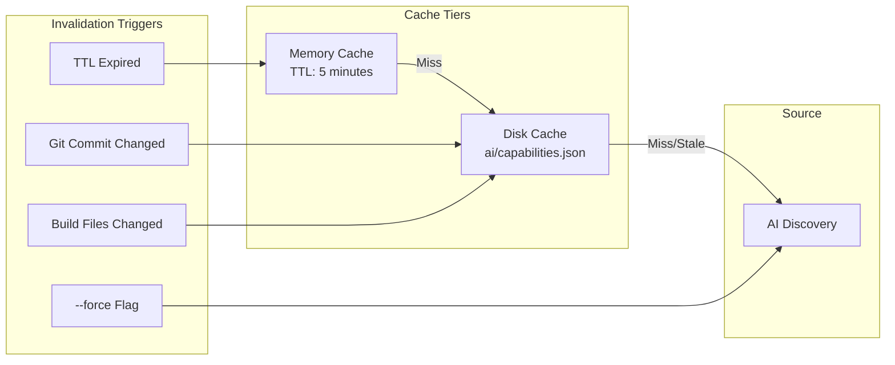
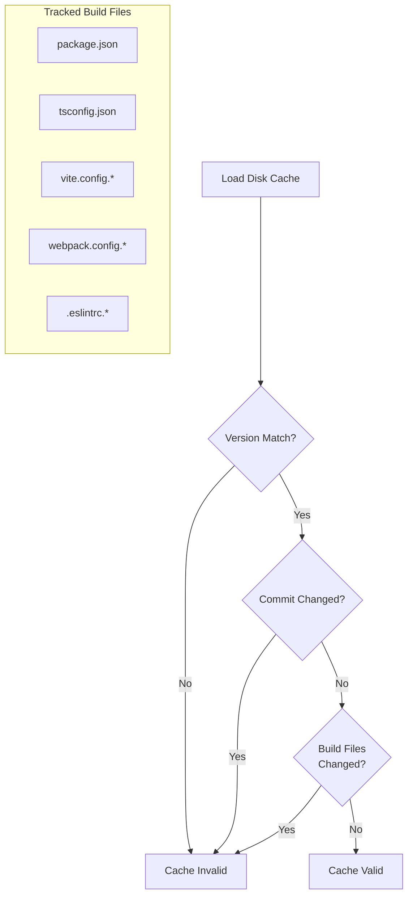
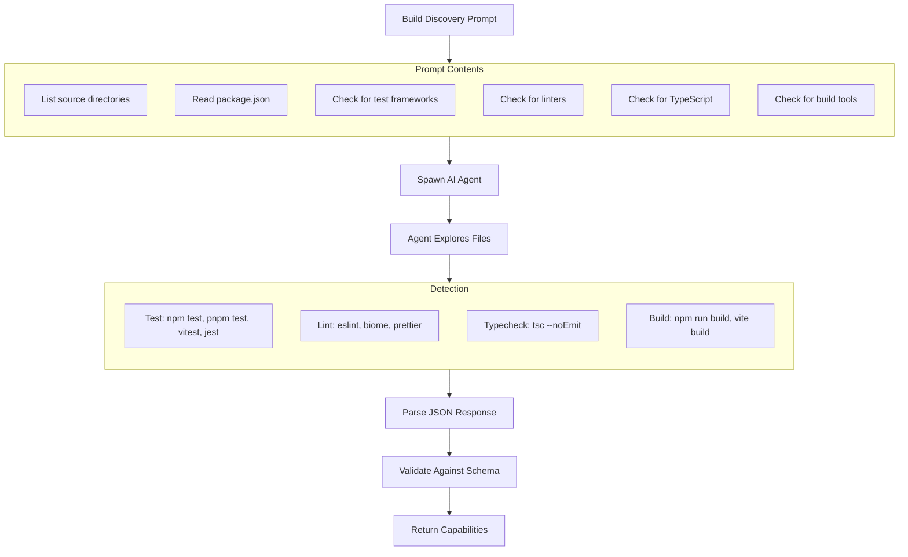
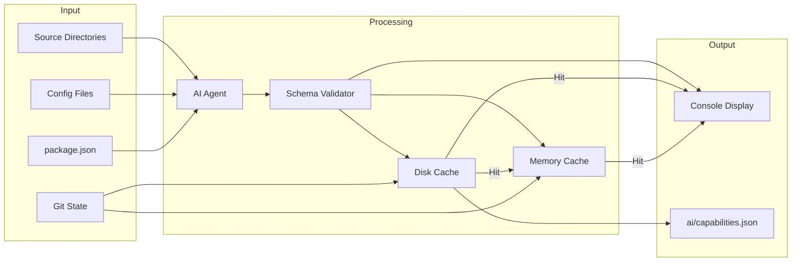

# scan Command

Scan and detect project verification capabilities using AI.

> 使用 AI 扫描并检测项目验证能力。

## Synopsis

```bash
agent-foreman scan [options]
```

## Description

The `scan` command detects and caches project verification capabilities such as test commands, lint commands, typecheck commands, and build commands. It uses a two-tier caching system (memory and disk) with AI-powered discovery when cache is stale or missing.

> `scan` 命令检测并缓存项目验证能力，如测试命令、lint 命令、类型检查命令和构建命令。它使用两层缓存系统（内存和磁盘），在缓存过期或缺失时使用 AI 驱动的发现。

## Options

| Option | Alias | Default | Description |
|--------|-------|---------|-------------|
| `--force` | `-f` | `false` | Force re-detection even if cache exists |
| `--verbose` | `-v` | `false` | Show detailed output |

## Execution Flow



## Cache System Architecture



### Memory Cache
- **TTL**: 5 minutes
- **Purpose**: Avoid repeated disk reads within same session
- **Location**: In-process memory

### Disk Cache
- **File**: `ai/capabilities.json`
- **Invalidation**: Git commit hash change or build file modifications
- **Persistence**: Survives process restarts

### Cache Invalidation Logic



## AI Discovery Process



## Capabilities Schema

```typescript
interface ExtendedCapabilities {
  // Detection metadata
  detectedAt: string;       // ISO timestamp
  commitHash?: string;      // Git commit at detection
  version?: string;         // Cache version

  // Verification commands
  test?: string;            // Full test command
  testCommand?: string;     // Alternative test command
  testFramework?: string;   // Framework name (jest, vitest, etc.)

  lint?: string;            // Lint command
  lintCommand?: string;     // Alternative lint command

  typecheck?: string;       // Typecheck command
  typecheckCommand?: string;// Alternative typecheck command

  build?: string;           // Build command
  buildCommand?: string;    // Alternative build command

  // Custom rules
  customRules?: {
    id: string;
    description: string;
    command: string;
  }[];
}
```

## Data Flow Diagram



## Dependencies

### Internal Modules

- `src/capabilities/index.ts` - Main API
  - `detectCapabilities()` - Orchestration function
- `src/capabilities/memory-cache.ts` - Memory caching
  - `getMemoryCache()`, `setMemoryCache()`
- `src/capabilities/disk-cache.ts` - Disk caching
  - `loadCachedCapabilities()`, `saveCapabilities()`
- `src/capabilities/git-invalidation.ts` - Cache invalidation
  - `isStale()`, `hasCommitChanged()`
- `src/capabilities/ai-discovery.ts` - AI-powered discovery
  - `discoverCapabilitiesWithAI()`
- `src/capabilities/formatters.ts` - Display formatting
  - `formatExtendedCapabilities()`
- `src/progress.ts` - Progress spinner
  - `createSpinner()`

### External Dependencies

- `chalk` - Console output styling
- AI CLI tools for discovery

## Files Read

| File | Purpose |
|------|---------|
| `ai/capabilities.json` | Cached capabilities |
| `package.json` | Detect test/build scripts |
| Config files | Detect tools (eslint, vite, etc.) |
| `.git/HEAD` | Git commit hash for invalidation |

## Files Written

| File | Purpose |
|------|---------|
| `ai/capabilities.json` | Save discovered capabilities |

## Exit Codes

| Code | Meaning |
|------|---------|
| 0 | Success |
| 1 | Scan failed |

## Examples

### Basic Scan

```bash
# Detect or use cached capabilities
agent-foreman scan
```

### Force Re-Detection

```bash
# Ignore cache and re-detect
agent-foreman scan --force
```

### Verbose Output

```bash
# Show detailed discovery process
agent-foreman scan -v
```

## Console Output Example

### Standard Output

```
🔍 Scanning project capabilities...

✓ Scan complete

  Capabilities:
  ✓ Test: pnpm test
    Framework: vitest
  ✓ Lint: pnpm lint
  ✓ Typecheck: pnpm typecheck
  ✓ Build: pnpm build

  Detected at: 2024-01-15T10:30:00Z
  Cache: ai/capabilities.json
```

### With Custom Rules

```
  Capabilities:
  ✓ Test: npm test
    Framework: jest
  ✓ Lint: npm run lint
  ✗ Typecheck: not detected
  ✓ Build: npm run build

  Custom Rules:
    e2e: Run E2E tests with Playwright
      Command: npm run test:e2e

  Detected at: 2024-01-15T10:30:00Z
  Cache: ai/capabilities.json
```

### Force Re-Detection

```
🔍 Scanning project capabilities...
   (forcing re-detection, ignoring cache)

✓ Scan complete

  Capabilities:
  ✓ Test: pnpm test
    Framework: vitest
  ...
```

### Verbose Mode

```
🔍 Scanning project capabilities...

  Checking memory cache...
  Memory cache miss
  Checking disk cache...
  Disk cache hit: ai/capabilities.json
  Validating cache...
  Cache is stale (commit changed)
  Starting AI discovery...
  Agent: claude
  Exploring project structure...
  Detected test framework: vitest
  Detected lint command: eslint
  ...

✓ Scan complete
```

## Cache File Example

```json
{
  "detectedAt": "2024-01-15T10:30:00Z",
  "commitHash": "abc1234def5678",
  "version": "1.0.0",
  "test": "pnpm test",
  "testFramework": "vitest",
  "lint": "pnpm lint",
  "typecheck": "pnpm typecheck",
  "build": "pnpm build",
  "customRules": []
}
```

## Related Commands

- `agent-foreman init` - Initialize harness (triggers capability scan)
- `agent-foreman check` - Uses capabilities for verification
- `agent-foreman done` - Uses capabilities for verification
