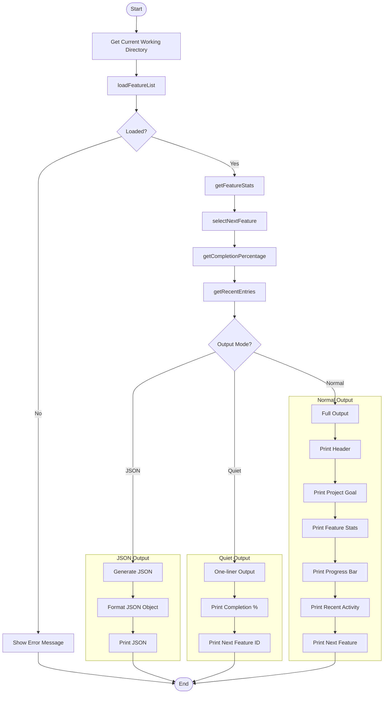
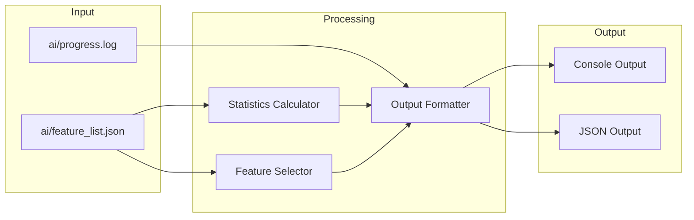
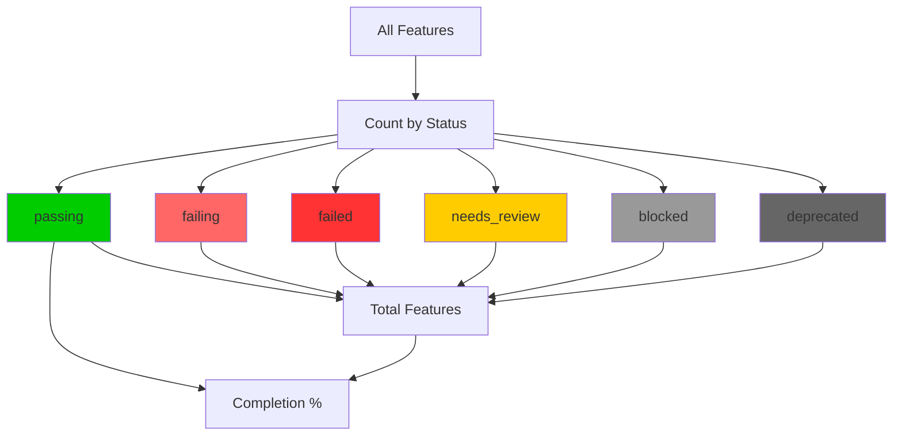

# status Command

Show current harness status and project progress.

> 显示当前工具包状态和项目进度。

## Synopsis

```bash
agent-foreman status [options]
```

## Description

The `status` command provides a comprehensive overview of the project's feature development progress. It displays feature statistics, completion percentage, recent activity, and the next feature to work on.

> `status` 命令提供项目功能开发进度的全面概述。它显示功能统计、完成百分比、最近活动以及下一个要处理的功能。

## Options

| Option | Alias | Default | Description |
|--------|-------|---------|-------------|
| `--json` | - | `false` | Output as JSON for scripting |
| `--quiet` | `-q` | `false` | Minimal output (one-liner) |

## Execution Flow



## Detailed Step-by-Step Flow

### 1. Load Feature List
- Load `ai/feature_list.json`
- If not found, display error and exit

### 2. Calculate Statistics
- **Feature Stats**: Count features by status
  - `passing` - Completed features
  - `failing` - Not yet implemented
  - `failed` - Implementation attempted but verification failed
  - `needs_review` - May be affected by changes
  - `blocked` - External dependency blocking
  - `deprecated` - No longer needed
- **Completion Percentage**: `passing / total * 100`
- **Next Feature**: Auto-select using priority algorithm
- **Recent Activity**: Last 5 progress log entries

### 3. Output Generation

**JSON Mode:**
```json
{
  "goal": "Project goal",
  "updatedAt": "ISO timestamp",
  "stats": { ... },
  "completion": 75,
  "recentActivity": [ ... ],
  "nextFeature": { ... }
}
```

**Quiet Mode:**
```
75% complete | 15/20 passing
Next: auth.register
```

**Normal Mode:**
- Project header with goal and last update
- Feature status breakdown
- Visual progress bar
- Recent activity log
- Next feature recommendation

## Data Flow Diagram



## Statistics Calculation



## Dependencies

### Internal Modules
- `src/feature-list.ts` - Feature operations
  - `loadFeatureList()` - Load feature data
  - `selectNextFeature()` - Get next priority feature
  - `getFeatureStats()` - Calculate status counts
  - `getCompletionPercentage()` - Calculate completion
- `src/progress-log.ts` - Progress tracking
  - `getRecentEntries()` - Load recent activity

### External Dependencies
- `chalk` - Console output styling

## Files Read

| File | Purpose |
|------|---------|
| `ai/feature_list.json` | Feature backlog and metadata |
| `ai/progress.log` | Recent activity entries |

## Files Written

None - this is a read-only command.

## Exit Codes

| Code | Meaning |
|------|---------|
| 0 | Success (always, even if no feature list) |

## JSON Output Schema

```json
{
  "goal": "string",
  "updatedAt": "ISO timestamp",
  "stats": {
    "passing": "number",
    "failing": "number",
    "failed": "number",
    "needsReview": "number",
    "blocked": "number",
    "deprecated": "number",
    "total": "number"
  },
  "completion": "number (0-100)",
  "recentActivity": [
    {
      "type": "INIT | STEP | CHANGE | REPLAN | VERIFY",
      "timestamp": "ISO timestamp",
      "summary": "string"
    }
  ],
  "nextFeature": {
    "id": "string",
    "description": "string",
    "status": "string"
  } | null
}
```

## Examples

### Basic Status
```bash
# Show full project status
agent-foreman status
```

### JSON Output
```bash
# Output as JSON for scripting
agent-foreman status --json
```

### Completion Check in CI
```bash
# Quick check for CI pipelines
agent-foreman status -q
```

### Parse with jq
```bash
# Get completion percentage
agent-foreman status --json | jq '.completion'

# Get next feature ID
agent-foreman status --json | jq -r '.nextFeature.id'
```

## Console Output Example

### Normal Mode
```
📊 Project Status
   Goal: Build a task management API
   Last updated: 2024-01-15T10:30:00Z

   Feature Status:
   ✓ Passing: 15
   ⚠ Needs Review: 2
   ✗ Failing: 8
   ⚡ Failed: 1
   ⏸ Blocked: 0
   ⊘ Deprecated: 0

   Completion: [████████████████░░░░░░░░░░░░░░] 58%

   Recent Activity:
   2024-01-15 [STEP] Completed auth.login
   2024-01-15 [VERIFY] Verified auth.register: pass
   2024-01-14 [CHANGE] Updated api.users acceptance
   2024-01-14 [STEP] Completed api.users.list
   2024-01-14 [INIT] Initialized harness

   Next Up:
   → auth.register: User registration with email verification
```

### Quiet Mode
```
58% complete | 15/26 passing
Next: auth.register
```

### JSON Mode
```json
{
  "goal": "Build a task management API",
  "updatedAt": "2024-01-15T10:30:00Z",
  "stats": {
    "passing": 15,
    "failing": 8,
    "failed": 1,
    "needsReview": 2,
    "blocked": 0,
    "deprecated": 0,
    "total": 26
  },
  "completion": 58,
  "recentActivity": [
    {
      "type": "STEP",
      "timestamp": "2024-01-15T10:30:00Z",
      "summary": "Completed auth.login"
    }
  ],
  "nextFeature": {
    "id": "auth.register",
    "description": "User registration with email verification",
    "status": "failing"
  }
}
```

## Progress Bar Visualization

The progress bar uses 30 characters to visualize completion:

| Completion | Progress Bar |
|------------|--------------|
| 0% | `[░░░░░░░░░░░░░░░░░░░░░░░░░░░░░░]` |
| 25% | `[████████░░░░░░░░░░░░░░░░░░░░░░]` |
| 50% | `[███████████████░░░░░░░░░░░░░░░]` |
| 75% | `[██████████████████████░░░░░░░░]` |
| 100% | `[██████████████████████████████]` |

## Status Color Coding

| Status | Symbol | Color |
|--------|--------|-------|
| passing | ✓ | Green |
| needs_review | ⚠ | Yellow |
| failing | ✗ | Red |
| failed | ⚡ | Red |
| blocked | ⏸ | Gray |
| deprecated | ⊘ | Gray |

## Related Commands

- `agent-foreman next` - Get next feature details
- `agent-foreman init` - Initialize harness
- `agent-foreman check` - Verify feature
- `agent-foreman done` - Complete feature
