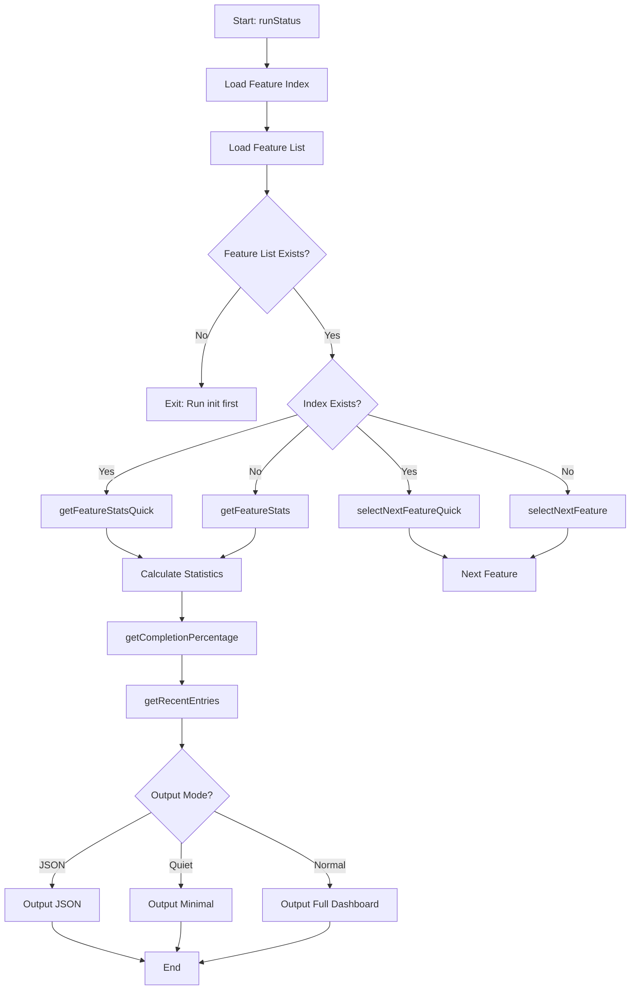
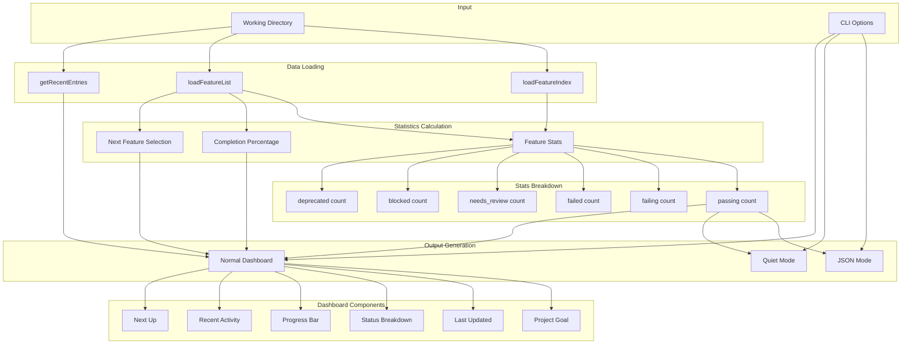

# status Command

Show current task/feature harness status overview.

## Command Syntax

```bash
agent-foreman status [options]
```

## Description

The `status` command displays a comprehensive overview of the project's task status, including counts by status, completion percentage, recent activity, and the next task to work on.

## Options

| Option | Alias | Type | Default | Description |
|--------|-------|------|---------|-------------|
| `--json` | - | boolean | `false` | Output as JSON for scripting |
| `--quiet` | `-q` | boolean | `false` | Suppress decorative output |

## Execution Flow



## Data Flow Diagram



## Key Functions

### `runStatus(outputJson, quiet)`

**Location**: `src/commands/status.ts:21`

Main entry point for the status command.

**Parameters**:
- `outputJson: boolean` - Enable JSON output mode
- `quiet: boolean` - Enable minimal output mode

### `getFeatureStats(features)` / `getFeatureStatsQuick(cwd)`

**Location**: `src/features/stats.ts`

Calculates task statistics by status.

**Returns**:
```typescript
{
  passing: number;
  failing: number;
  failed: number;
  needs_review: number;
  blocked: number;
  deprecated: number;
}
```

### `getCompletionPercentage(features)`

**Location**: `src/features/stats.ts`

Calculates overall completion percentage.

**Formula**: `(passing / (total - deprecated)) * 100`

### `getRecentEntries(cwd, count)`

**Location**: `src/progress-log.ts`

Retrieves recent progress log entries.

**Parameters**:
- `cwd: string` - Working directory
- `count: number` - Number of entries to retrieve

**Returns**: `ProgressLogEntry[]`

## Output Modes

### Normal Mode (Default)

```
📊 Project Status
   Goal: Build a REST API for user management
   Last updated: 2025-01-15T10:00:00Z

   Task Status:
   ✓ Passing: 5
   ⚠ Needs Review: 2
   ✗ Failing: 8
   ⚡ Failed: 1
   ⏸ Blocked: 0
   ⊘ Deprecated: 1

   Completion: [████████░░░░░░░░░░░░░░░░░░░░░░] 29%

   Recent Activity:
   2025-01-15 [STEP] Completed auth.login
   2025-01-14 [VERIFY] Verified auth.register: pass
   2025-01-14 [INIT] Initialized harness

   Next Up:
   → auth.logout: User can log out
```

### JSON Mode (`--json`)

```json
{
  "goal": "Build a REST API for user management",
  "updatedAt": "2025-01-15T10:00:00Z",
  "stats": {
    "passing": 5,
    "failing": 8,
    "failed": 1,
    "needsReview": 2,
    "blocked": 0,
    "deprecated": 1,
    "total": 17
  },
  "completion": 29,
  "recentActivity": [
    {
      "type": "STEP",
      "timestamp": "2025-01-15T10:30:00Z",
      "summary": "Completed auth.login"
    }
  ],
  "nextFeature": {
    "id": "auth.logout",
    "description": "User can log out",
    "status": "failing"
  }
}
```

### Quiet Mode (`--quiet`)

```
29% complete | 5/17 passing
Next: auth.logout
```

## Status Indicators

| Status | Icon | Color | Description |
|--------|------|-------|-------------|
| `passing` | ✓ | Green | Acceptance criteria met |
| `failing` | ✗ | Red | Not yet implemented |
| `failed` | ⚡ | Red | Implementation attempted but failed |
| `needs_review` | ⚠ | Yellow | Potentially affected by changes |
| `blocked` | ⏸ | Gray | External dependency blocking |
| `deprecated` | ⊘ | Gray | No longer needed |

## Progress Bar

Visual representation of completion:

```
[████████░░░░░░░░░░░░░░░░░░░░░░] 29%
 ^^^^^^^^                        ^^
 Filled (passing)               Percentage
         ^^^^^^^^^^^^^^^^^^^^^^
         Empty (remaining)
```

- Bar width: 30 characters
- Filled blocks (█): Proportional to completion
- Empty blocks (░): Remaining work

## Recent Activity Log Types

| Type | Color | Description |
|------|-------|-------------|
| `INIT` | Blue | Harness initialization |
| `STEP` | Green | Task status change |
| `CHANGE` | Yellow | Task modification |
| `REPLAN` | Magenta | Feature replanning |
| `VERIFY` | Magenta | Verification result |

## Examples

### Basic Status

```bash
# Show full status dashboard
agent-foreman status
```

### JSON Output

```bash
# Get status as JSON for scripting
agent-foreman status --json

# Extract specific info with jq
agent-foreman status --json | jq '.completion'
agent-foreman status --json | jq '.nextFeature.id'
```

### Quiet Mode

```bash
# Minimal output for quick checks
agent-foreman status -q
```

## Quick vs Full Operations

The status command uses optimized "quick" operations when a feature index exists:

| Operation | Quick (with index) | Full (without index) |
|-----------|-------------------|---------------------|
| Stats | `getFeatureStatsQuick` | `getFeatureStats` |
| Next Selection | `selectNextFeatureQuick` | `selectNextFeature` |
| Performance | O(1) index lookup | O(n) file loading |

The index file (`ai/tasks/index.json`) enables faster operations by caching:
- Feature statuses
- Priority numbers
- Module assignments

## Error Handling

| Error | Cause | Resolution |
|-------|-------|------------|
| "No task list found" | Harness not initialized | Run `agent-foreman init` first |

## Related Commands

- [`init`](./init.md) - Initialize the harness
- [`next`](./next.md) - Get next task details
- [`check`](./check.md) - Verify task implementation
- [`done`](./done.md) - Mark task as complete
