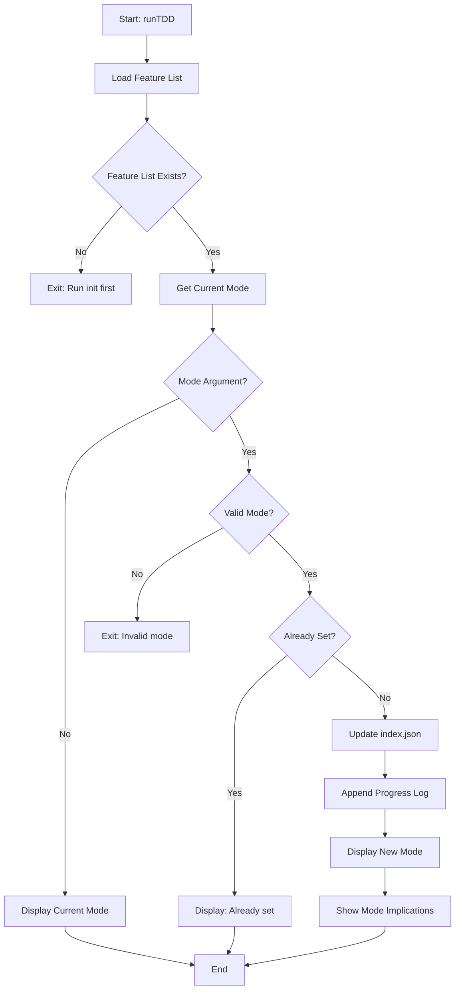

# tdd Command

View or change TDD mode configuration.

## Command Syntax

```bash
agent-foreman tdd [mode]
```

## Description

The `tdd` command allows you to view the current TDD (Test-Driven Development) mode or change it. TDD mode controls whether tests are required for task completion and how strictly the TDD workflow is enforced.

## Arguments

| Argument | Type | Required | Description |
|----------|------|----------|-------------|
| `mode` | string | No | TDD mode to set. If omitted, shows current mode |

## Mode Values

| Mode | Enforcement | Description |
|------|-------------|-------------|
| `strict` | Tests REQUIRED | TDD workflow is mandatory. `check` and `done` commands will fail without test files |
| `recommended` | Tests suggested | TDD guidance shown but not enforced (default) |
| `disabled` | No enforcement | No TDD guidance or requirements |

## Execution Flow



## Key Functions

### `runTDD(mode?)`

**Location**: `src/commands/tdd.ts:20`

Main entry point for the tdd command.

**Parameters**:
- `mode?: string` - TDD mode to set (strict, recommended, disabled)

## Output Examples

### View Current Mode

```bash
agent-foreman tdd
```

Output:
```
📋 TDD Configuration

   Current mode: recommended

   Available modes:
   • strict      - Tests REQUIRED, TDD workflow mandatory
   • recommended - Tests suggested, TDD workflow optional (default)
   • disabled    - No TDD guidance

   Usage: agent-foreman tdd <mode>
   Example: agent-foreman tdd strict
```

### Set Strict Mode

```bash
agent-foreman tdd strict
```

Output:
```
✓ TDD mode changed: recommended → strict

   ⚠ STRICT MODE ACTIVE
   • Tests are REQUIRED for all tasks
   • check/done will FAIL without test files
   • MUST follow TDD: RED → GREEN → REFACTOR
```

### Set Recommended Mode

```bash
agent-foreman tdd recommended
```

Output:
```
✓ TDD mode changed: strict → recommended

   📋 RECOMMENDED MODE
   • Tests are suggested but not required
   • TDD guidance shown in 'next' output
   • Tasks can complete without tests
```

### Set Disabled Mode

```bash
agent-foreman tdd disabled
```

Output:
```
✓ TDD mode changed: recommended → disabled

   ○ TDD DISABLED
   • No TDD guidance shown
   • No test requirements enforced
```

## Mode Behavior Impact

### Strict Mode

When TDD mode is `strict`:
- `agent-foreman next` shows TDD enforcement warning
- `agent-foreman check` verifies test files exist before running verification
- `agent-foreman done` blocks completion without passing tests
- All tasks auto-migrate to `testRequirements.unit.required: true`

### Recommended Mode (Default)

When TDD mode is `recommended`:
- TDD guidance is shown in `agent-foreman next` output
- Tests are suggested but not enforced
- Tasks can complete even without test files
- TDD workflow is optional

### Disabled Mode

When TDD mode is `disabled`:
- No TDD guidance is displayed
- No test requirements are enforced
- Useful for non-code projects or legacy migrations

## Storage

TDD mode is stored in `ai/tasks/index.json` under `metadata.tddMode`:

```json
{
  "metadata": {
    "tddMode": "strict",
    "updatedAt": "2025-01-15T10:00:00Z"
  }
}
```

## Progress Log

Mode changes are logged to `ai/progress.log`:

```
2025-01-15T10:00:00Z CHANGE task=tdd-mode action=config reason="Changed TDD mode from 'recommended' to 'strict'"
```

## Error Handling

| Error | Cause | Resolution |
|-------|-------|------------|
| "No task list found" | Harness not initialized | Run `agent-foreman init` first |
| "Invalid TDD mode" | Mode not in valid list | Use: strict, recommended, or disabled |

## Related Commands

- [`init`](./init.md) - Initialize harness (prompts for TDD mode)
- [`next`](./next.md) - Shows TDD guidance based on mode
- [`check`](./check.md) - Enforces TDD gate in strict mode
- [`done`](./done.md) - Enforces TDD gate in strict mode
