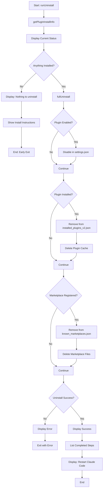
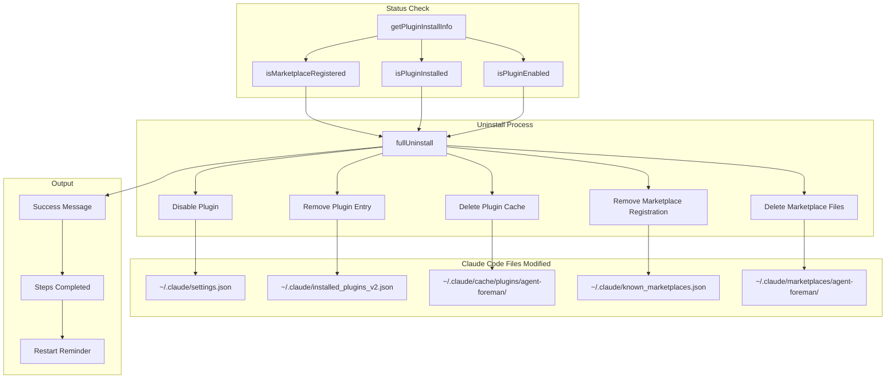

# uninstall Command

Remove the agent-foreman Claude Code plugin.

## Command Syntax

```bash
agent-foreman uninstall
```

## Description

The `uninstall` command removes the agent-foreman plugin from Claude Code, including disabling the plugin, removing registration entries, and deleting cached files.

## Execution Flow



## Data Flow Diagram



## Uninstallation Steps

### 1. Disable Plugin

Removes from enabled plugins in `~/.claude/settings.json`:

```json
{
  "enabledPlugins": [
    // "agent-foreman:agent-foreman" removed
  ]
}
```

### 2. Remove Plugin Entry

Removes from `~/.claude/installed_plugins_v2.json`:

```json
{
  "plugins": [
    // agent-foreman entry removed
  ]
}
```

### 3. Delete Plugin Cache

Removes directory:
```
~/.claude/cache/plugins/agent-foreman@agent-foreman-plugins/
```

### 4. Remove Marketplace Registration

Removes entry from `~/.claude/known_marketplaces.json`:

```json
{
  "marketplaces": [
    // agent-foreman entry removed
  ]
}
```

### 5. Delete Marketplace Files

Removes directory:
```
~/.claude/marketplaces/agent-foreman/
```

## Key Functions

### `runUninstall()`

**Location**: `src/commands/uninstall.ts:17`

Main entry point for the uninstall command.

### `fullUninstall()`

**Location**: `src/plugin-installer.ts`

Performs complete uninstallation process.

**Steps**:
1. Disable plugin in settings.json
2. Remove from installed_plugins_v2.json
3. Delete plugin cache directory
4. Remove from known_marketplaces.json
5. Delete marketplace directory

## Output Example

### Successful Uninstall

```
Agent Foreman Plugin Uninstaller
────────────────────────────────────────

Current Status:
  Marketplace: ✓ registered
  Plugin:      ✓ installed (0.1.91)
  Enabled:     ✓ yes

Uninstalling plugin...

✓ Plugin uninstalled successfully!

Steps completed:
  • Disabled in settings.json
  • Removed from installed_plugins_v2.json
  • Deleted plugin cache
  • Removed from known_marketplaces.json
  • Deleted marketplace files

⚡ Restart Claude Code to complete removal
```

### Nothing to Uninstall

```
Agent Foreman Plugin Uninstaller
────────────────────────────────────────

Current Status:
  Marketplace: not registered
  Plugin:      not installed
  Enabled:     no

Nothing to uninstall - plugin is not installed.

To install the plugin:
  agent-foreman install
```

### Partial Installation

```
Agent Foreman Plugin Uninstaller
────────────────────────────────────────

Current Status:
  Marketplace: ✓ registered
  Plugin:      not installed
  Enabled:     no

Uninstalling plugin...

✓ Plugin uninstalled successfully!

Steps completed:
  • Removed from known_marketplaces.json
  • Deleted marketplace files

⚡ Restart Claude Code to complete removal
```

## Examples

### Basic Uninstall

```bash
# Remove the plugin
agent-foreman uninstall
```

## Cleanup Verification

After uninstalling, verify these locations are cleaned:

```bash
# Check if files are removed
ls ~/.claude/marketplaces/agent-foreman/  # Should not exist
ls ~/.claude/cache/plugins/ | grep agent-foreman  # Should be empty
cat ~/.claude/settings.json | grep agent-foreman  # Should not appear
```

## Error Handling

| Error | Cause | Resolution |
|-------|-------|------------|
| "Failed to uninstall" | Permission issue | Check file permissions |
| Partial cleanup | Interrupted process | Re-run uninstall |

## Related Commands

- [`install`](./install.md) - Install the plugin
- [`upgrade`](./upgrade.md) - Update to latest version
