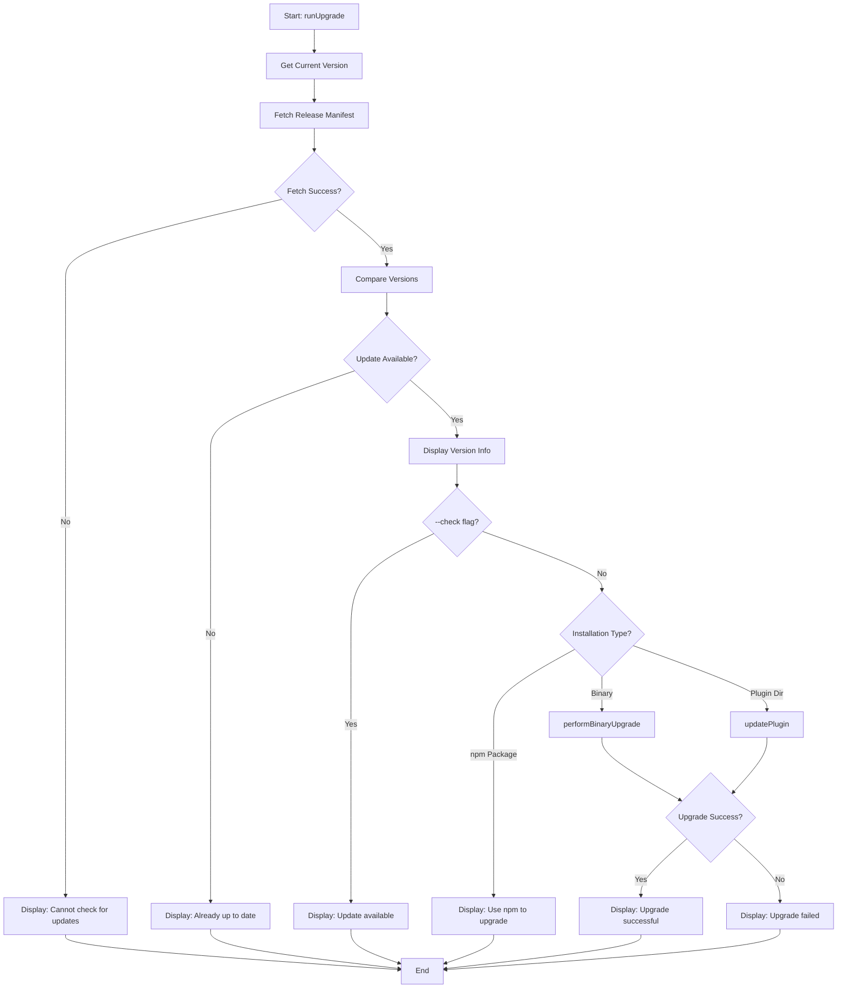
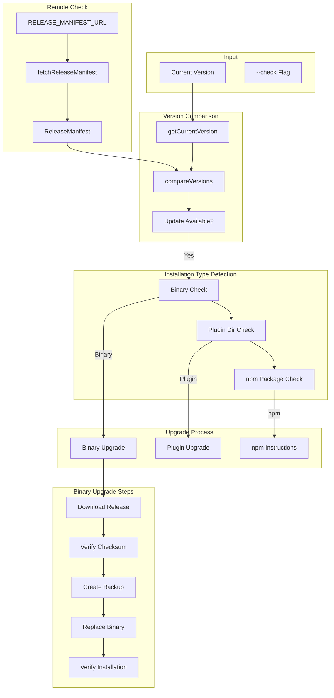
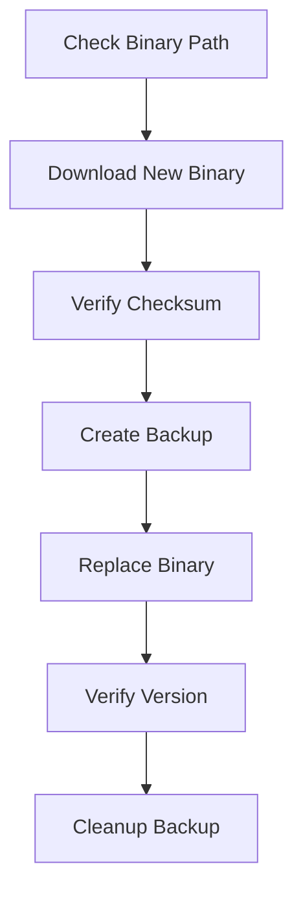
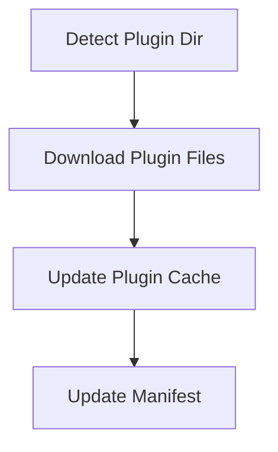
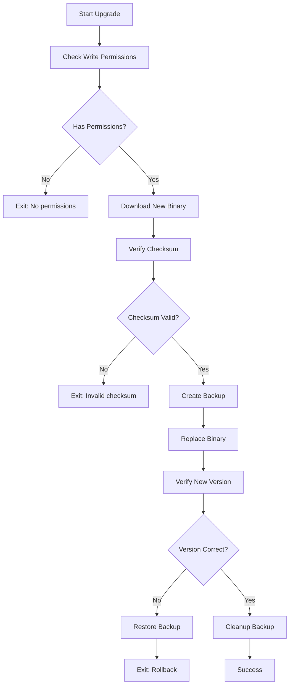

# upgrade Command

Check for updates and upgrade to the latest version.

## Command Syntax

```bash
agent-foreman upgrade [options]
```

## Description

The `upgrade` command checks for new versions of agent-foreman and optionally upgrades to the latest version. It supports both npm package and standalone binary installations.

## Options

| Option | Alias | Type | Default | Description |
|--------|-------|------|---------|-------------|
| `--check` | `-c` | boolean | `false` | Only check for updates, do not install |

## Execution Flow



## Data Flow Diagram



## Key Functions

### `runUpgrade(checkOnly)`

**Location**: `src/upgrade/index.ts`

Main entry point for the upgrade command.

**Parameters**:
- `checkOnly: boolean` - Only check, don't install

### `checkForUpgrade()`

**Location**: `src/upgrade/index.ts`

Checks if an upgrade is available.

**Returns**:
```typescript
interface UpgradeCheckResult {
  updateAvailable: boolean;
  currentVersion: string;
  latestVersion: string;
  releaseNotes?: string;
  downloadUrl?: string;
}
```

### `fetchReleaseManifest()`

**Location**: `src/upgrade/index.ts`

Fetches the release manifest from the server.

**Returns**:
```typescript
interface ReleaseManifest {
  version: string;
  releaseDate: string;
  assets: ReleaseAsset[];
  releaseNotes?: string;
  checksums: Record<string, string>;
}
```

### `performBinaryUpgrade()`

**Location**: `src/upgrade/index.ts`

Performs binary upgrade for standalone installations.

### `updatePlugin()`

**Location**: `src/upgrade/index.ts`

Updates the Claude Code plugin.

## Installation Types

### Standalone Binary

When installed as a standalone binary:



### npm Package

When installed via npm:

```bash
# Global installation
npm update -g agent-foreman

# Local installation
npm update agent-foreman
```

### Claude Code Plugin

When running as a plugin:



## Release Manifest

The upgrade system uses a release manifest:

```json
{
  "version": "0.1.91",
  "releaseDate": "2025-01-15T10:00:00Z",
  "assets": [
    {
      "platform": "darwin-arm64",
      "url": "https://releases.example.com/agent-foreman-darwin-arm64",
      "checksum": "sha256:..."
    },
    {
      "platform": "darwin-x64",
      "url": "https://releases.example.com/agent-foreman-darwin-x64",
      "checksum": "sha256:..."
    },
    {
      "platform": "linux-x64",
      "url": "https://releases.example.com/agent-foreman-linux-x64",
      "checksum": "sha256:..."
    }
  ],
  "releaseNotes": "Bug fixes and improvements",
  "checksums": {
    "darwin-arm64": "sha256:...",
    "darwin-x64": "sha256:...",
    "linux-x64": "sha256:..."
  }
}
```

## Output Examples

### Check Only

```bash
$ agent-foreman upgrade --check
```

```
🔍 Checking for updates...

Current version: 0.1.90
Latest version:  0.1.91

✓ Update available!
  Run 'agent-foreman upgrade' to install
```

### Up to Date

```
🔍 Checking for updates...

Current version: 0.1.91
Latest version:  0.1.91

✓ Already up to date!
```

### Successful Upgrade

```
🔍 Checking for updates...

Current version: 0.1.90
Latest version:  0.1.91

⬇ Downloading update...
✓ Downloaded agent-foreman-darwin-arm64
✓ Checksum verified
✓ Backup created
✓ Binary replaced
✓ Installation verified

🎉 Successfully upgraded to v0.1.91!
```

### npm Installation

```
🔍 Checking for updates...

Current version: 0.1.90
Latest version:  0.1.91

Update available!

This appears to be an npm installation.
To upgrade, run:

  npm update -g agent-foreman
```

## Binary Upgrade Safety



## Examples

### Check for Updates

```bash
# Check without installing
agent-foreman upgrade --check
agent-foreman upgrade -c
```

### Perform Upgrade

```bash
# Upgrade to latest version
agent-foreman upgrade
```

## Auto-Upgrade Check

The CLI periodically checks for updates:
- Check interval: 24 hours
- Cache file: `~/.agent-foreman/upgrade-check.json`
- Silent check on command execution

```typescript
// Auto-check on startup (non-blocking)
if (shouldCheckForUpgrade()) {
  checkForUpgrade().then(displayUpgradeHint);
}
```

## Error Handling

| Error | Cause | Resolution |
|-------|-------|------------|
| "Cannot fetch manifest" | Network issue | Check internet connection |
| "Invalid checksum" | Corrupted download | Retry download |
| "No write permissions" | Permission denied | Run with elevated permissions |
| "Rollback required" | Failed verification | Restore attempted automatically |

## Platform Support

| Platform | Architecture | Support |
|----------|--------------|---------|
| macOS | arm64 | ✓ |
| macOS | x64 | ✓ |
| Linux | x64 | ✓ |
| Linux | arm64 | ✓ |
| Windows | x64 | ✓ |

## Related Commands

- [`install`](./install.md) - Install plugin
- [`agents`](./agents.md) - Check agent status
